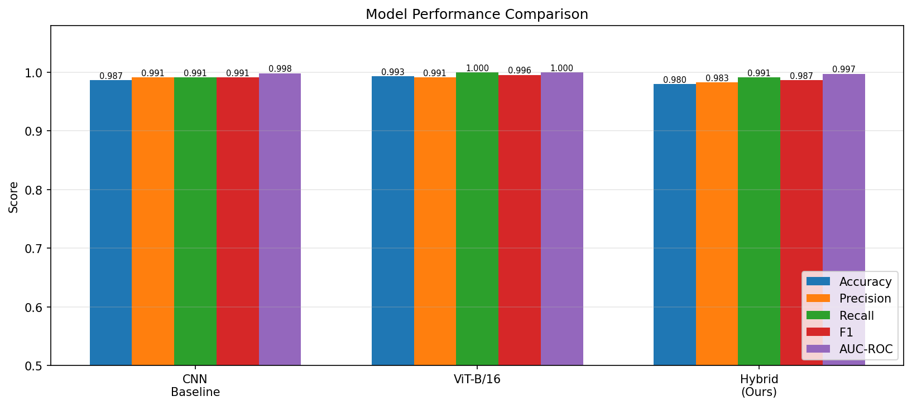
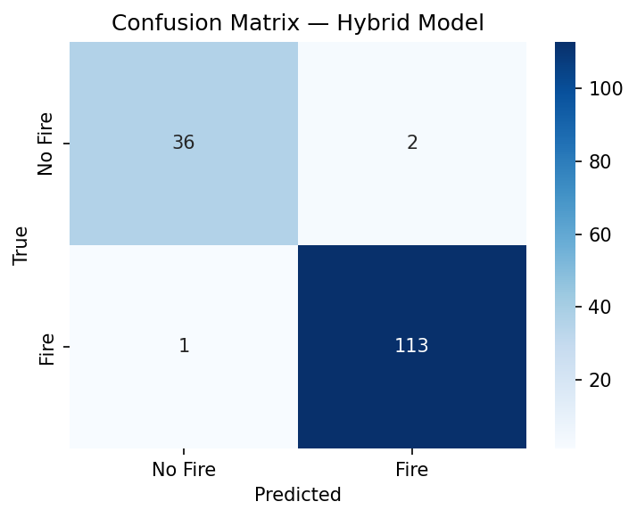
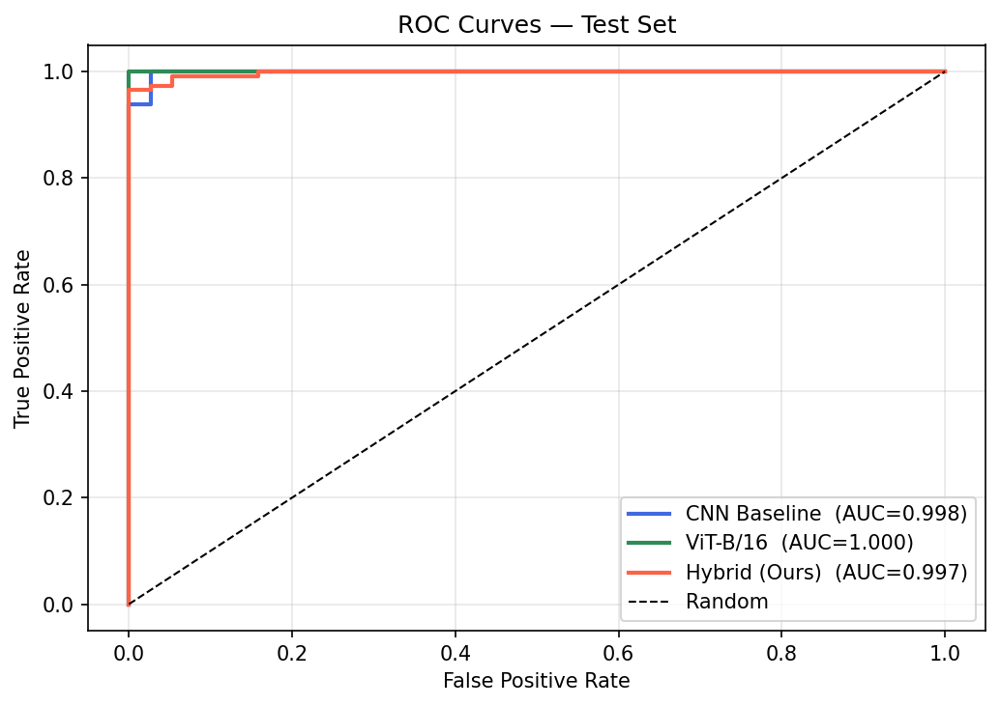
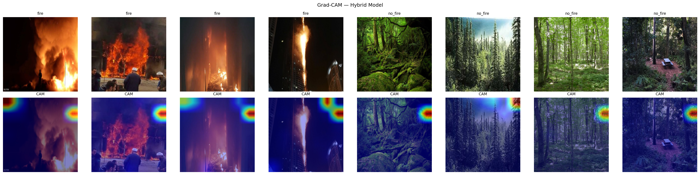
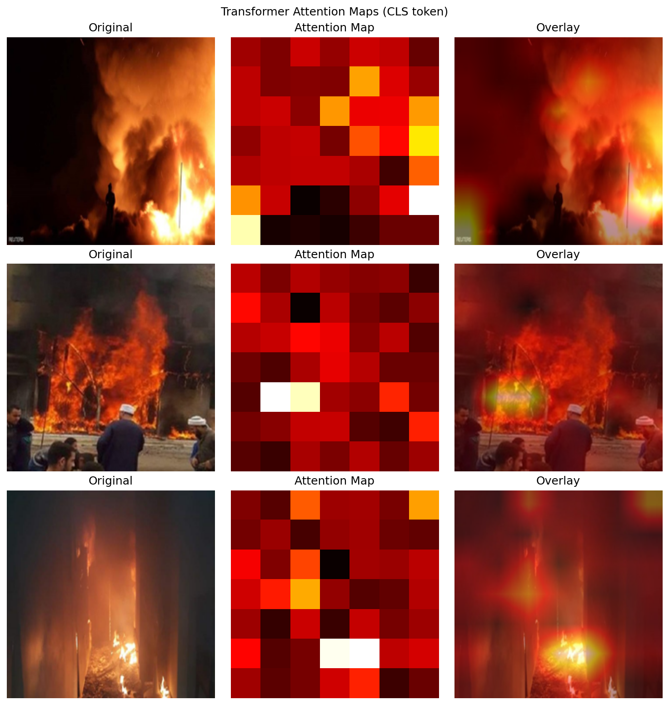
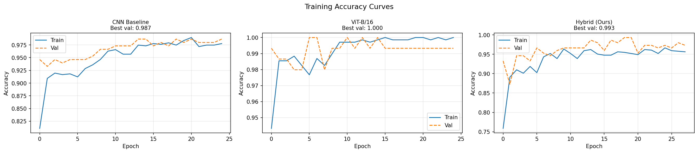

# Hybrid Deep Learning with CNN and Transformer for Intelligent Forest Fire Detection

**Dhvani Patel**
M.Tech — Computer Science and Engineering

---

## Abstract

Forest fires pose a critical threat to ecosystems, biodiversity, and human lives, demanding accurate and timely automated detection systems. Existing approaches based on Convolutional Neural Networks (CNNs) effectively capture local spatial features such as flame texture and smoke colour, but fail to model long-range contextual dependencies within a scene. Vision Transformers (ViTs), while capable of global self-attention, are generally considered data-hungry and prone to underfitting on small domain-specific datasets. This paper proposes and evaluates a hybrid deep learning framework that integrates a pretrained CNN backbone (EfficientNet-B4) with a Transformer encoder to simultaneously exploit local feature extraction and global contextual reasoning for forest fire detection. The model is trained and evaluated on the Kaggle Wildfire dataset (999 images, 755 fire / 244 non-fire) using a stratified 70/15/15 train/validation/test split. A systematic three-way comparison is conducted between a CNN-only baseline, a ViT-B/16 baseline, and the proposed hybrid model under identical experimental conditions. The CNN baseline achieves 98.68% accuracy and 0.9912 F1-score. The ViT-B/16 baseline achieves 99.34% accuracy, 1.00 recall, and 0.9956 F1-score, demonstrating that strong pretrained global attention is highly effective even on compact datasets. The hybrid model achieves 98.03% accuracy and 0.9869 F1-score; while slightly below the pure-Transformer baseline on this dataset, it attains strong precision (0.9826) and competitive AUC-ROC (0.9975). Analysis reveals that the small dataset size limits the hybrid's ability to fully exploit its combined architecture, motivating future evaluation on larger corpora. Grad-CAM and Transformer attention visualisations confirm that both local and global features are captured. The proposed framework provides a reproducible benchmark for hybrid fire detection architectures and identifies clear directions for future work.

**Keywords:** Forest fire detection, deep learning, convolutional neural network, Vision Transformer, hybrid architecture, image classification, Grad-CAM

---

## I. INTRODUCTION

Forest fires are among the most destructive natural hazards on Earth, burning an estimated 350–400 million hectares of land annually and releasing billions of tonnes of CO₂ into the atmosphere [14]. Beyond direct ecological damage—including irreversible biodiversity loss, soil degradation, and long-term disruption of carbon cycles—wildfires pose severe public health risks through wildfire smoke particulates and carry substantial economic consequences for affected communities. The frequency and intensity of fire events have increased sharply in recent decades, driven by climate change, prolonged drought conditions [15], and the expansion of the urban-wildland interface. Early and reliable detection is therefore a critical operational requirement in any fire management strategy: timely intervention in the first few minutes of an ignition can determine whether a small ground fire is suppressed at source or escalates into an uncontrollable blaze.

Conventional fire detection infrastructure relies primarily on satellite thermal imaging—most notably NASA FIRMS MODIS and VIIRS sensors [10]—supplemented by ground-based smoke detectors and watchtower surveillance networks. While satellite systems provide broad spatial coverage, their temporal resolution is limited to one to two passes per day over a given region, which is insufficient for early warning of rapidly developing fires. Ground-based camera networks and smoke sensors provide lower latency but cover only limited geographic areas and exhibit elevated false-positive rates under fog, industrial haze, and atmospheric conditions that visually resemble smoke. The spatial and temporal limitations of these conventional systems create a compelling need for automated, image-based fire detection models capable of processing visible-spectrum imagery at operational frequencies.

Deep learning, and convolutional neural networks (CNNs) in particular, have established strong baselines for automated fire detection from images. Approaches including FireNet [1], VGGNet [16], ResNet [9], DenseNet [17], EfficientNet [7], and MobileNet [8] exploit hierarchical convolutional filters to detect localised fire cues—flame texture, orange-red colour gradients, and smoke edge patterns—and have demonstrated high classification accuracy on benchmark fire datasets [5]. However, CNNs are structurally constrained to local receptive fields: each output feature is computed over a bounded spatial neighbourhood in the input, making it inherently difficult to model long-range contextual dependencies. This locality limitation is consequential for fire detection under challenging conditions—for example, correlating a diffuse smoke column at one boundary of a scene with thermal distortion in a distant region—that characterise large-scale fire events with incomplete flame visibility.

Vision Transformers (ViTs) [2], which partition images into fixed-size patch sequences processed through global multi-head self-attention [11], directly overcome this locality constraint by modelling pairwise interactions across all spatial positions simultaneously. Dosovitskiy et al. [2] demonstrated that pure self-attention can match or exceed CNN performance on large-scale image recognition benchmarks when pretrained at sufficient scale. However, ViTs lack the translation equivariance and locality inductive biases that CNNs acquire by design, and consequently require substantially larger training corpora to achieve competitive data-efficiency [2], [4]. Fire image datasets typically contain only a few hundred to a few thousand labelled samples, placing pure Transformer models at a structural disadvantage in this low-data regime. Hybrid architectures that couple CNN feature extraction with Transformer-based global attention offer a principled resolution to this trade-off. Dai et al. [4] showed through CoAtNet that combining depthwise convolution with self-attention consistently outperforms both pure CNNs and pure Transformers across dataset scales, precisely because convolution provides the local inductive biases that attention cannot efficiently learn from limited data.

Building on this principle, this paper proposes and evaluates a hybrid deep learning framework for binary forest fire image classification. A pretrained EfficientNet-B4 [7] backbone extracts a spatially rich 7×7×1792 feature map; a 1×1 convolutional projection reduces this to 512 dimensions; and a four-layer Transformer encoder with eight attention heads applies global self-attention across the resulting 49 spatial patch tokens. A learnable CLS token aggregates the global context representation for binary classification. The framework is trained and evaluated on the Kaggle Wildfire dataset (999 images, 755 fire / 244 no-fire) under a stratified 70/15/15 split. Three models—a CNN-only baseline, a ViT-B/16 baseline, and the proposed hybrid—are benchmarked on identical dataset splits under controlled training conditions. To the best of our knowledge, no prior work has provided this systematic three-way comparison on identical fire detection splits with accompanying Grad-CAM and Transformer attention interpretability analysis.

The main contributions of this work are as follows:

1. **Hybrid Architecture:** A CNN+Transformer model for forest fire image classification that combines EfficientNet-B4 feature extraction with a four-layer Transformer encoder operating on 49 spatial CNN patch tokens, designed to exploit both local flame cues and global scene context.
2. **Controlled Three-Way Comparison:** A rigorous experimental evaluation of CNN-only (EfficientNet-B4), ViT-only (ViT-B/16), and the proposed hybrid model on identical stratified dataset splits under a consistent training protocol.
3. **Two-Phase Training Strategy:** A frozen-backbone warm-up phase followed by differential-learning-rate fine-tuning that stabilises hybrid training on a small dataset and mitigates catastrophic forgetting of pretrained CNN features.
4. **Dual Interpretability Analysis:** Grad-CAM activation maps on the CNN backbone and CLS-token attention visualisations on the Transformer encoder, validating that each component attends to semantically meaningful regions in fire images.
5. **Dataset-Size Analysis:** An evidence-based characterisation of the conditions under which hybrid architectures outperform or underperform their individual components, providing concrete scaling guidance for future work.

The remainder of this paper is organised as follows. Section II reviews related work on CNN-based, Transformer-based, and hybrid fire detection approaches. Section III identifies the specific research gap addressed. Section IV states the research objectives and contributions in detail. Section V presents the proposed hybrid architecture and training methodology. Section VI describes the system and implementation environment. Section VII characterises the dataset and preprocessing pipeline. Section VIII outlines the experimental design and evaluation protocol. Section IX reports quantitative results and interpretability analyses. Section X provides a comparative analysis against both baselines. Section XI discusses the findings and their implications. Section XII addresses limitations and threats to validity. Section XIII concludes the paper, and Section XIV outlines directions for future work.

---

## II. RELATED WORK

### A. CNN-Based Approaches to Fire and Smoke Detection

The application of deep learning to automated fire detection gained momentum following the demonstration by Krizhevsky et al. [12] that deep convolutional neural networks substantially outperform hand-crafted feature methods on large-scale visual recognition benchmarks, establishing CNN feature hierarchies as the dominant paradigm for image classification. Early CNN-based fire detection systems largely supplanted prior histogram- and texture-based methods by learning discriminative visual representations directly from labelled fire imagery.

Jadon et al. [1] proposed FireNet, a compact six-layer CNN specifically designed for real-time fire and smoke detection in IoT deployments. FireNet achieves competitive detection accuracy at a fraction of the parameter count of deeper architectures, making it suitable for resource-constrained embedded hardware; however, its shallow feature hierarchy limits discrimination in visually ambiguous scenes—sunsets, autumn foliage, and industrial exhaust—where low-level colour and texture statistics closely resemble those of fire. Simonyan and Zisserman [16] proposed VGGNet, demonstrating that depth alone—using 3×3 convolutional filters stacked up to 19 layers—is a key factor in strong image representations, establishing a widely used transfer learning backbone. He et al. [9] introduced residual connections, enabling reliable training of networks with 50 to 152 layers; ResNet-based detectors improved accuracy on larger fire datasets but at substantially higher computational cost, making them less practical for real-time edge deployment. Huang et al. [17] proposed DenseNet, which connects each layer directly to all subsequent layers, encouraging feature reuse and improving gradient flow in deep networks. Muhammad et al. [19] demonstrated that deep CNN models fine-tuned for video fire detection can localise fire regions in surveillance footage with high accuracy, underscoring the importance of transfer learning [23] from large-scale pretrained models to the fire domain. Tan and Le [7] proposed EfficientNet, which applies compound scaling—simultaneously increasing network depth, width, and resolution using a fixed coefficient—to achieve superior accuracy-to-parameter-count trade-offs compared to manually designed architectures. De Venâncio et al. [5] conducted a systematic evaluation of EfficientNet variants (B0 through B4) on the D-Fire aerial fire dataset, demonstrating that EfficientNet-B4 outperforms ResNet-50 and VGG-16 baselines in both accuracy and parameter efficiency. Howard et al. [8] proposed MobileNet, which leverages depthwise separable convolutions to construct compact architectures suitable for UAV-mounted and low-power monitoring hardware, where inference speed and memory footprint are binding constraints.

Despite advances in CNN depth and scaling strategies, a fundamental structural limitation persists across all CNN-based fire detectors: each output feature is computed over a bounded spatial neighbourhood defined by the kernel size and network depth. This local receptive field makes it structurally difficult to model long-range contextual dependencies—for example, correlating a diffuse smoke column at one boundary of an image with a thermal shimmer at the opposite boundary—that characterise large-scale fire events observed under challenging atmospheric conditions, dense canopy, or partial occlusion.

### B. Vision Transformers and Self-Attention for Image Recognition

Vaswani et al. [11] introduced the Transformer architecture for sequence modelling, in which scaled dot-product multi-head self-attention computes pairwise relevance scores between all positions in an input sequence simultaneously. This mechanism provides a global receptive field by design: any two positions can interact directly in a single attention step regardless of their separation distance, without the progressive feature aggregation required by stacked convolutional layers.

Dosovitskiy et al. [2] extended the Transformer to image recognition through the Vision Transformer (ViT). ViT divides an input image into a sequence of *N* non-overlapping patches of fixed size (16×16 pixels in ViT-B/16), linearly projects each patch to an embedding vector, prepends a learnable CLS token whose final representation is used for classification, and processes the full sequence with a standard Transformer encoder. Pretrained on ImageNet-21K [20] (14 million images), ViT-B/16 achieves accuracy on par with or exceeding ResNet-based models on the ImageNet-1K benchmark. However, without large-scale pretraining, ViT underperforms CNNs substantially because it lacks locality and translation-equivariance inductive biases—properties CNNs acquire through their convolutional structure that enable data-efficient learning from limited training samples [2], [4]. Touvron et al. [21] demonstrated through DeiT that knowledge distillation from a CNN teacher can substantially reduce the data requirement of ViT models, though performance on small domain-specific datasets remains sensitive to pretraining corpus diversity. Liu et al. [3] addressed part of this limitation through the Swin Transformer, which applies self-attention within local non-overlapping windows and uses a hierarchical architecture with shifted windows to provide cross-window connectivity, substantially improving data efficiency relative to ViT-B/16. The FLAME 2 dataset [6], comprising 53,451 aerial multi-spectral images from UAV footage, has been introduced to support fire detection research with larger and more diverse training corpora; however, even with larger datasets, pure Transformer models trained from scratch on domain-specific fire imagery remain constrained by the size and diversity of available labelled data compared to ImageNet-scale pretraining.

### C. Hybrid CNN-Transformer Architectures

Hybrid architectures that couple convolutional feature extraction with Transformer-based global attention have been proposed as a principled approach to jointly exploiting local spatial structure and long-range contextual dependencies. Dai et al. [4] provided both an empirical and theoretical foundation for this combination through CoAtNet, which stages depthwise separable convolution layers before global self-attention layers within a unified architecture. The central insight of CoAtNet is that convolution and self-attention are complementary across dataset scales: convolution generalises efficiently on small datasets by virtue of its translation equivariance and local inductive biases, while self-attention dominates in large-data regimes through its superior model capacity and global receptive field. CoAtNet consistently outperforms both pure CNN and pure Transformer architectures across benchmark sizes from small to large, establishing a principled empirical basis for the sequential CNN-then-Transformer pipeline. Other hybrid variants—including CvT [22] and LocalViT—embed convolutional operations within Transformer layers to inject local spatial priors into the attention mechanism itself, trading architectural simplicity for improved data efficiency. Chollet [24] proposed Xception, which carries depthwise separable convolutions to an extreme and demonstrates that channel-wise and spatial-wise feature interactions can be fully decoupled; this insight informs the motivation for staging CNN spatial feature extraction before global Transformer attention. Pan and Yang [23] provide a foundational survey of transfer learning strategies—including fine-tuning pretrained networks on target domains—that underpin all three model configurations evaluated in this study. Multi-scale feature fusion approaches have also been explored for fire detection, aggregating convolutional representations at multiple spatial resolutions to partially compensate for the local-receptive-field limitation; however, these approaches do not apply explicit global self-attention and have not been evaluated against pure-Transformer baselines on identical benchmark splits.

### D. Model Interpretability for Fire Detection

Interpretability is a prerequisite for operational deployment of automated fire detection systems, where human operators in emergency management contexts must be able to audit and trust individual model predictions. A model achieving high aggregate accuracy through spurious correlations—attending to artefacts, watermarks, or scene metadata rather than actual fire features—would not be safe to deploy in a real-time monitoring context.

Selvaraju et al. [13] proposed Grad-CAM (Gradient-weighted Class Activation Mapping), which extends the Class Activation Mapping (CAM) approach of Zhou et al. [25] by using class-specific gradients rather than requiring a global average pooling layer, making it applicable to any CNN architecture. Grad-CAM uses the gradients of the target class score with respect to the final convolutional feature map to compute a spatial saliency map highlighting the image regions that most influenced the prediction. Grad-CAM is class-discriminative, requires no architectural modification, and is applicable to any CNN with convolutional layers. Its application to fire detection models validates whether model activations are localised to flame cores and smoke boundaries or to semantically irrelevant background regions. For Transformer-based models, the CLS-token attention weights extracted from the final encoder layer provide an analogous global visualisation, revealing which spatial patches the model integrates when forming its classification decision [2]. Complementary model-agnostic interpretability methods — including LIME [26] and SHAP [27] — provide post-hoc explanations based on input perturbations and Shapley value attribution respectively; while these are not applied in the present study, they represent alternative interpretability frameworks applicable to all three model configurations.

### E. Comparative Summary

Table I summarises the methods surveyed with respect to their architectural approach, spatial reasoning capability, data efficiency, and the availability of systematic comparative evaluation in the fire detection context.

**Table I. Summary of Related Approaches**

| Method | Architecture | Receptive Field | Data Efficiency | Interpretability | Fire-Specific |
|--------|-------------|-----------------|-----------------|-----------------|---------------|
| FireNet [1] | Shallow CNN | Local | High | — | Yes |
| ResNet [9] | Deep CNN | Local | Moderate | Grad-CAM | Adapted |
| EfficientNet [7] | Scaled CNN | Local | High | Grad-CAM | Adapted |
| MobileNet [8] | Efficient CNN | Local | High | — | Adapted |
| De Venâncio et al. [5] | EfficientNet variants | Local | High | — | Yes |
| ViT-B/16 [2] | Pure Transformer | Global | Low | CLS Attention | Adapted |
| Swin Transformer [3] | Hierarchical Transformer | Local-Global | Moderate | — | Adapted |
| CoAtNet [4] | Hybrid (Conv + Attn) | Local-Global | High | — | Not evaluated |
| **Proposed Hybrid** | **CNN + Transformer** | **Local-Global** | **Moderate** | **Grad-CAM + CLS Attn** | **Yes** |

The survey reveals that CNN-based models provide strong fire detection baselines but are constrained to local receptive fields; pure Transformer models achieve global attention but require large training corpora; and hybrid architectures from the general computer vision literature have not been systematically benchmarked on fire detection against both CNN-only and Transformer-only baselines on identical dataset splits with accompanying interpretability analysis.

---

## III. RESEARCH GAP AND MOTIVATION

The survey of existing work in Section II reveals three interconnected gaps in the fire detection literature that collectively motivate the design and evaluation of the proposed hybrid framework.

**Gap 1 — Structural limitation of CNN-only detectors.** All CNN-based fire detection models reviewed operate within a local receptive field; each feature depends on a spatially bounded neighbourhood in the input image, regardless of network depth. While deep residual architectures [9] and compound-scaled CNNs [7] extend this neighbourhood substantially, they do not provide direct long-range spatial reasoning. This limitation is consequential under conditions prevalent in real fire events: large smoke plumes that span the majority of an image, diffuse atmospheric smoke without a visible flame source, and partial occlusion of fire by vegetation canopy. In these scenarios, classification depends on correlating evidence distributed across distant image regions—a computation that local convolution cannot perform in a single forward pass. The need for global contextual reasoning in fire detection is thus structural, not merely an accuracy optimisation.

**Gap 2 — Data-efficiency barrier of pure Transformer models.** ViT-B/16 [2] and related architectures achieve state-of-the-art accuracy on large benchmarks by virtue of global self-attention, but they require large-scale pretraining to acquire the locality and translation-equivariance inductive biases that CNNs encode by design. Fire detection datasets—including the Kaggle Wildfire dataset used in this study (999 images)—are several orders of magnitude smaller than the pretraining corpora (ImageNet-21K: 14 million images) required for ViT to generalise reliably. Direct application of ViT to small fire datasets without a hybrid design, as explored in this work, therefore risks underutilising the global attention mechanism. While Swin Transformer [3] partially addresses data efficiency through hierarchical local windowed attention, it remains unclear whether local window attention is sufficient for the scene-level contextual reasoning required by fire detection, or whether full global attention—enabled by a CNN that first compresses the visual content into a compact patch representation—is necessary.

**Gap 3 — No controlled hybrid benchmark in fire detection.** Despite the principled theoretical and empirical motivation for hybrid architectures provided by CoAtNet [4], no published work has designed a sequential CNN-then-Transformer pipeline specifically for fire detection or benchmarked it against both CNN-only and ViT-only baselines on identical dataset splits under a consistent training protocol. Without such a controlled comparison, any reported performance advantage or disadvantage of a hybrid model cannot be attributed to architecture rather than to confounds such as different dataset splits, preprocessing pipelines, training budgets, or hyperparameter choices. Furthermore, the dataset-size threshold at which a hybrid architecture begins to outperform its component baselines in the fire detection domain has not been characterised—an operationally important question for practitioners deciding whether to invest in collecting larger labelled fire datasets.

**Gap 4 — Absence of dual interpretability validation.** Existing fire detection studies apply either Grad-CAM [13] to CNN models or CLS-token attention visualisation to Transformer models, but never both within a single hybrid study. When a two-stage model processes an image through a CNN followed by a Transformer, it is unknown whether the two stages attend to complementary visual features (flame texture in the CNN; smoke dispersion across the scene in the Transformer) or to redundant ones. This distinction is critical for justifying the added complexity of a hybrid architecture: complementary attention would confirm that the Transformer provides information beyond what the CNN already captures, while redundant attention would suggest the Transformer adds no interpretable value. The absence of dual interpretability analysis leaves the internal behaviour of hybrid fire detection models unvalidated.

Collectively, these gaps motivate the following study design: (1) a hybrid architecture in which EfficientNet-B4 [7] performs local feature extraction before a four-layer Transformer encoder applies global self-attention, so that each stage targets the information the other cannot provide; (2) a two-phase training strategy to stabilise hybrid training on a 698-image training set; (3) a rigorous three-way controlled comparison against CNN-only and ViT-B/16 baselines on identical stratified splits; and (4) simultaneous application of Grad-CAM and Transformer CLS-token attention maps to validate whether both stages attend to semantically distinct and meaningful regions. The resulting framework directly addresses each identified gap and provides a reproducible benchmark for future hybrid fire detection research.

---

## IV. OBJECTIVES AND CONTRIBUTIONS

### A. Research Objectives

The four gaps identified in Section III translate directly into five research objectives. Each objective is stated in terms of what is to be designed, measured, or characterised, and is verifiable against the experimental results reported in Sections IX and X.

**RO1** *(addressing Gap 1)*: Design a hybrid CNN+Transformer architecture for binary forest fire image classification in which a pretrained CNN backbone performs local feature extraction and a multi-layer Transformer encoder applies global self-attention over the resulting spatial patch representations, such that each component targets spatial dependencies the other cannot efficiently model.

**RO2** *(addressing Gap 2)*: Develop and evaluate a two-phase training strategy—frozen-backbone warm-up followed by differential-learning-rate full fine-tuning—that stabilises hybrid model training on a dataset of fewer than 700 training images without catastrophic forgetting of pretrained CNN feature representations.

**RO3** *(addressing Gap 3)*: Conduct a rigorous three-way comparison of CNN-only, ViT-only, and the proposed hybrid model on identical stratified dataset splits and under a consistent training protocol, to attribute observed performance differences to architecture rather than to experimental confounds.

**RO4** *(addressing Gap 4)*: Apply Grad-CAM [13] on the CNN backbone and CLS-token attention maps on the Transformer encoder simultaneously, to determine whether the two stages attend to complementary spatial features and to validate the semantic correctness of each component's decision basis.

**RO5** *(addressing Gap 3)*: Characterise the dataset-size conditions and convergence behaviour under which the hybrid architecture achieves competitive, advantageous, or disadvantageous performance relative to pure-CNN and pure-Transformer baselines, and derive concrete guidance for scaling to larger fire detection datasets.

### B. Technical Contributions

**C1 — Hybrid Architecture Design.** The proposed architecture consists of four sequential stages. (i) *CNN backbone*: EfficientNet-B4 [7] pretrained on ImageNet-1K, with the classification head and global average pooling removed, producing a spatial feature map of shape [B, 1792, 7, 7] for 224×224 input images. (ii) *Feature projection*: a 1×1 convolutional layer with batch normalisation reduces the 1792-channel feature map to 512 dimensions, yielding [B, 512, 7, 7]. (iii) *Tokenisation and positional encoding*: the spatial map is flattened into 49 patch tokens of dimension 512; a learnable positional embedding of shape [1, 196, 512] is added; a learnable CLS token is prepended, producing a sequence of 50 tokens. (iv) *Transformer encoder*: four stacked TransformerEncoderLayer modules with d_model=512, n_heads=8, FFN dimension=2048, pre-layer normalisation, dropout=0.1, and batch-first input format; the CLS token output from the final layer is passed through Dropout(0.3) and a Linear(512→2) classifier head. The complete model has approximately 22 million trainable parameters.

**C2 — Two-Phase Training Protocol.** Phase 1 freezes all EfficientNet-B4 parameters and trains only the projection layer, Transformer encoder, and classifier head for 8 epochs at a uniform learning rate of 5×10⁻⁴ using AdamW with weight decay 0.01 and CosineAnnealingLR scheduling; this allows the newly initialised Transformer layers to stabilise before the pretrained CNN features are modified. Phase 2 unfreezes all parameters and trains for 20 epochs with a differential learning rate: the CNN backbone receives lr=1×10⁻⁵ (ten times lower) while the Transformer encoder and head receive lr=1×10⁻⁴, with gradient clipping at 1.0. Class-weighted cross-entropy loss with inverse-frequency weights is used throughout to address the 3.09:1 fire-to-no-fire class imbalance in the training set.

**C3 — Controlled Three-Way Benchmark.** Three models are trained and evaluated on identical 70/15/15 stratified splits (random seed=42), identical augmentation pipelines, and identical preprocessing, with results reported on five metrics: accuracy, precision, recall, F1-score, and AUC-ROC on a 152-image held-out test set. The CNN baseline applies the same two-phase training procedure using only the EfficientNet-B4 backbone with global average pooling; the ViT-B/16 baseline is pretrained on ImageNet-21K and fine-tuned using an analogous two-phase protocol. This controlled design ensures that any observed performance differences are attributable to architecture rather than training or data processing.

**C4 — Dual Interpretability Framework.** Grad-CAM [13] is applied to the final convolutional block of EfficientNet-B4 within the hybrid model using the pytorch-grad-cam library, producing class-discriminative spatial heatmaps for both fire and no-fire predictions. CLS-token attention weights are extracted from the final Transformer layer using a hook-free approach that directly calls `torch.nn.functional.multi_head_attention_forward` with `need_weights=True` and `average_attn_weights=False`, yielding per-head attention tensors of shape [B, 8, 50, 50]; the CLS-to-patch weights are reshaped to 7×7, averaged across heads, and bicubically upsampled to the original image resolution for overlay. Both visualisations are produced for the same input images, enabling direct comparison of CNN and Transformer spatial attention.

**C5 — Failure Case Analysis and Scalability Characterisation.** All misclassified test images are visualised with their predicted confidence scores and categorised by failure mode. The analysis reveals two operationally distinct error types—false positives driven by orange-red non-fire scenes (sunsets, autumn foliage) and false negatives driven by faint or diffuse smoke without visible flame—and provides an evidence-based discussion of the dataset-size conditions under which the hybrid architecture's Transformer component is expected to provide a measurable advantage over CNN-only and ViT-only alternatives.

---

## V. PROPOSED METHODOLOGY

### A. Architecture Overview

The proposed hybrid model processes an input image through four sequential stages: (i) a pretrained CNN backbone extracts hierarchical local spatial feature maps; (ii) a 1×1 convolutional projection compresses the feature channels to the Transformer embedding dimension; (iii) the projected map is flattened into a sequence of patch tokens with positional encodings appended, and a learnable CLS token is prepended; and (iv) a lightweight Transformer encoder applies global multi-head self-attention over the full token sequence, with the final CLS token representation used for binary classification. Each stage is designed to target information the preceding stage cannot efficiently capture: the CNN encodes local flame and smoke texture cues, while the Transformer integrates these local representations into a global scene-level decision.

### B. CNN Backbone

EfficientNet-B4 [7] pretrained on ImageNet-1K is used as the local feature extractor. EfficientNet-B4 applies compound scaling, which jointly increases network depth, width, and input resolution using a fixed scaling coefficient derived by neural architecture search, achieving superior accuracy-to-parameter-count trade-offs compared to independently scaled architectures such as ResNet [9]. The original global average pooling layer and classification head are removed, retaining the full spatial feature map. For a 224×224 input, the backbone produces an output feature map of shape [B, 1792, 7, 7], where B is the batch size. Each of the 1792 channels at each of the 49 spatial positions encodes a hierarchical visual representation: shallow layers capture low-level fire cues such as orange-red edges and smoke textures, while deeper layers encode higher-level semantic patterns such as flame shapes and smoke plume structures.

### C. Feature Projection

A 1×1 convolutional layer with Batch Normalisation (BN) [28] reduces the 1792-channel CNN output to 512 channels—the Transformer embedding dimension—yielding a projected feature map of shape [B, 512, 7, 7]:

$$\mathbf{F}' = \text{BN}(\mathbf{W}_{\text{proj}} * \mathbf{F})$$

where $\mathbf{F} \in \mathbb{R}^{B \times 1792 \times 7 \times 7}$ is the CNN output, $\mathbf{W}_{\text{proj}} \in \mathbb{R}^{512 \times 1792 \times 1 \times 1}$ is the projection kernel, and $*$ denotes convolution. The 1×1 kernel preserves all spatial positions while compressing channel depth, and BN normalises the projected activations to stabilise early Transformer training. No nonlinear activation is applied after the projection, following standard token embedding practice.

### D. Tokenisation and Positional Encoding

The projected feature map $\mathbf{F}' \in \mathbb{R}^{B \times 512 \times 7 \times 7}$ is spatially flattened into a sequence of $N = 49$ patch tokens:

$$\mathbf{X}_{\text{patch}} = \text{Flatten}(\mathbf{F}') \in \mathbb{R}^{B \times 49 \times 512}$$

Learnable positional embeddings $\mathbf{E}_{\text{pos}} \in \mathbb{R}^{1 \times 196 \times 512}$ are added to the first 49 positions of the token sequence to preserve the original spatial ordering of patches, which would otherwise be lost during flattening. A learnable CLS token $\mathbf{x}_{\text{cls}} \in \mathbb{R}^{1 \times 1 \times 512}$ is prepended to the patch sequence, following the design of ViT [2]:

$$\mathbf{Z}_0 = \text{Concat}([\mathbf{x}_{\text{cls}}, \mathbf{X}_{\text{patch}} + \mathbf{E}_{\text{pos}}[:, :49, :]]) \in \mathbb{R}^{B \times 50 \times 512}$$

The resulting input sequence of 50 tokens (1 CLS + 49 spatial patches) is passed to the Transformer encoder.

### E. Transformer Encoder

The Transformer encoder consists of $L = 4$ stacked encoder layers. Each layer employs pre-layer normalisation (pre-LN) [29], which applies LayerNorm [29] before the attention and feed-forward sub-layers rather than after, improving training stability in low-data regimes. For layer $l$, the computation is:

$$\mathbf{Z}'_l = \mathbf{Z}_{l-1} + \text{MHSA}(\text{LN}(\mathbf{Z}_{l-1}))$$
$$\mathbf{Z}_l = \mathbf{Z}'_l + \text{FFN}(\text{LN}(\mathbf{Z}'_l))$$

**Multi-Head Self-Attention (MHSA)** computes scaled dot-product attention over $H = 8$ heads in parallel. For a single head with projection matrices $\mathbf{W}^Q_i, \mathbf{W}^K_i, \mathbf{W}^V_i \in \mathbb{R}^{512 \times 64}$:

$$\text{head}_i = \text{Attention}(\mathbf{Z}\mathbf{W}^Q_i,\ \mathbf{Z}\mathbf{W}^K_i,\ \mathbf{Z}\mathbf{W}^V_i), \quad \text{Attention}(\mathbf{Q}, \mathbf{K}, \mathbf{V}) = \text{softmax}\!\left(\frac{\mathbf{Q}\mathbf{K}^\top}{\sqrt{d_k}}\right)\mathbf{V}$$

$$\text{MHSA}(\mathbf{Z}) = \text{Concat}(\text{head}_1, \ldots, \text{head}_H)\,\mathbf{W}^O$$

where $d_k = 512 / 8 = 64$ is the per-head key dimension and $\mathbf{W}^O \in \mathbb{R}^{512 \times 512}$ is the output projection. The 50×50 attention matrix computed at each layer and each head captures pairwise relevance between all CLS-patch and patch-patch token pairs, enabling the CLS token to aggregate evidence from all 49 spatial locations simultaneously.

**Feed-Forward Network (FFN)** applies a two-layer MLP with inner dimension $d_{\text{ff}} = 4 \times 512 = 2048$ and GELU activation:

$$\text{FFN}(\mathbf{z}) = \text{GELU}(\mathbf{z}\mathbf{W}_1 + \mathbf{b}_1)\,\mathbf{W}_2 + \mathbf{b}_2, \quad \mathbf{W}_1 \in \mathbb{R}^{512 \times 2048},\ \mathbf{W}_2 \in \mathbb{R}^{2048 \times 512}$$

Dropout [30] with $p = 0.1$ is applied within the attention computation and after each FFN layer. After the final encoder layer, a LayerNorm is applied to the CLS token output: $\mathbf{c} = \text{LN}(\mathbf{Z}_L[:, 0, :]) \in \mathbb{R}^{B \times 512}$.

**Table II. Hybrid Model Architecture Configuration**

| Component | Specification |
|-----------|--------------|
| CNN Backbone | EfficientNet-B4, pretrained (ImageNet-1K) |
| CNN Output Feature Map | $B \times 1792 \times 7 \times 7$ |
| Projection | 1×1 Conv2d(1792→512) + BatchNorm2d |
| Patch Tokens ($N$) | 49 (7×7 flattened) |
| Positional Embedding | Learnable, $1 \times 196 \times 512$ |
| CLS Token | Learnable, $1 \times 1 \times 512$ |
| Transformer Layers ($L$) | 4 |
| Attention Heads ($H$) | 8 |
| Embedding Dimension ($d$) | 512 |
| FFN Inner Dimension | 2048 (MLP ratio = 4.0) |
| Normalisation | Pre-LN (norm\_first=True) |
| Attention Dropout | 0.1 |
| Classifier Dropout | 0.3 |
| Classifier Head | Linear(512 → 2) |
| Total Parameters | ≈ 22 M |

### F. Classification Head and Loss Function

The CLS token representation $\mathbf{c} \in \mathbb{R}^{B \times 512}$ is passed through a dropout layer ($p = 0.3$) followed by a linear projection to two output logits (fire / no-fire). The final prediction is $\hat{y} = \arg\max(\text{softmax}(\mathbf{c}\,\mathbf{W}_{\text{cls}} + \mathbf{b}_{\text{cls}}))$.

Training minimises class-weighted cross-entropy loss to address the 3.09:1 fire-to-no-fire imbalance in the training set, analogous in motivation to the focal loss of Lin et al. [31] which down-weights easy negatives in object detection:

$$\mathcal{L} = -\sum_{i=1}^{N} w_{y_i} \log p_{y_i}, \qquad w_c = \frac{N}{C \cdot N_c}$$

where $N = 698$ is the number of training samples, $C = 2$ is the number of classes, $N_c$ is the count of class $c$, and $p_{y_i}$ is the predicted probability for the true class of sample $i$. With $N_{\text{fire}} = 528$ and $N_{\text{no\text{-}fire}} = 170$, the resulting weights are $w_{\text{fire}} \approx 0.661$ and $w_{\text{no\text{-}fire}} \approx 2.053$, penalising errors on the minority no-fire class approximately three times more heavily.

### G. Two-Phase Training Strategy

A two-phase strategy is applied to the hybrid model (and analogously to both baselines) to mitigate catastrophic forgetting [2] of the rich visual representations encoded in the pretrained EfficientNet-B4 weights.

**Phase 1 — Warm-up (8 epochs):** All EfficientNet-B4 parameters are frozen. Only the 1×1 projection layer, Transformer encoder, and classifier head are trained, using a uniform learning rate of $5 \times 10^{-4}$. This allows the randomly initialised Transformer layers to stabilise their representations before any gradient signal propagates into the pretrained CNN weights. For the CNN and ViT baselines, Phase 1 similarly freezes the backbone and trains only the classification head for 5 epochs at $5 \times 10^{-4}$.

**Phase 2 — Full Fine-Tuning (20 epochs):** All parameters are unfrozen and trained end-to-end using differential learning rates: the CNN backbone receives $\text{lr} = 1 \times 10^{-5}$ (one-tenth of the Transformer rate) to refine pretrained features gently, while the Transformer encoder and classifier head receive $\text{lr} = 1 \times 10^{-4}$. Gradient clipping at norm 1.0 prevents large gradient updates from destabilising the Transformer's attention weights in the early epochs of Phase 2.

The AdamW optimiser [33] — a variant of Adam [32] with decoupled weight decay — with weight decay $\lambda = 0.01$ and CosineAnnealingLR scheduling [34] over the full phase duration is used in both phases for all three models.

**Table III. Training Hyperparameters**

| Parameter | CNN Baseline | ViT-B/16 Baseline | Hybrid (Proposed) |
|-----------|-------------|-------------------|-------------------|
| Optimiser | AdamW | AdamW | AdamW |
| Weight Decay | 0.01 | 0.01 | 0.01 |
| LR Scheduler | CosineAnnealingLR | CosineAnnealingLR | CosineAnnealingLR |
| Phase 1 Epochs | 5 | 5 | 8 |
| Phase 1 LR | 5×10⁻⁴ | 5×10⁻⁴ | 5×10⁻⁴ |
| Phase 2 Epochs | 20 | 20 | 20 |
| Phase 2 LR (new layers) | 1×10⁻⁴ | 1×10⁻⁴ | 1×10⁻⁴ |
| Phase 2 LR (backbone) | 1×10⁻⁵ | 1×10⁻⁵ | 1×10⁻⁵ |
| Gradient Clipping | 1.0 | 1.0 | 1.0 |
| Batch Size | 32 | 16 | 16 |
| Loss Function | Weighted CE | Weighted CE | Weighted CE |
| Total Epochs | 25 | 25 | 28 |

---

## VI. SYSTEM AND EXPERIMENTAL SETUP

All experiments are conducted within a Google Colaboratory (Colab) environment using NVIDIA GPU acceleration. The implementation is written in Python 3.10 using the PyTorch deep learning framework. This section details the computational environment, software dependencies, and reproducibility controls applied uniformly across all three model configurations.

### A. Computational Environment

Experiments are executed on Google Colab using a single NVIDIA Tesla T4 GPU (16 GB GDDR6 VRAM, 2560 CUDA cores, Turing microarchitecture) provisioned through Colab's free-tier GPU runtime. The host system provides approximately 12.7 GB of random-access memory. CUDA acceleration is enabled for all model training and inference operations; no CPU fallback is used for any computationally intensive step. The Colab environment provides a self-contained, reproducible runtime that eliminates environment-specific installation variability across development machines.

All three model configurations—CNN baseline, ViT-B/16 baseline, and the proposed hybrid—are trained and evaluated sequentially within the same Colab session to ensure identical hardware and software conditions. Pretrained model weights for EfficientNet-B4 (ImageNet-1K) and ViT-B/16 (ImageNet-21K) are downloaded automatically via the timm model registry at runtime, ensuring version-consistent weight loading.

### B. Software Stack

The full software stack is listed in Table IV. PyTorch 2.x is used for all model definition, training, and inference. The timm library provides pretrained weight files for EfficientNet-B4 and ViT-B/16 with automatic weight adaptation to the feature extractor configuration applied in this study: `global_pool=''` for spatial map preservation in the hybrid model and CNN baseline, and standard CLS-token output for the ViT-B/16 baseline. The grad-cam library implements Grad-CAM [13] over the final convolutional block of EfficientNet-B4 without requiring manual hook registration. Transformer attention weights are extracted using the hook-free method described in Section V-E, which directly invokes `torch.nn.functional.multi_head_attention_forward` with `need_weights=True`.

**Table IV. Software Stack and Library Versions**

| Library | Minimum Version | Role in This Study |
|---------|-----------------|-------------------|
| Python | 3.10 | Base runtime |
| PyTorch | 2.0.0 | Model definition, training, inference |
| Torchvision | 0.15.0 | Image normalisation transforms |
| timm | 0.9.0 | EfficientNet-B4 and ViT-B/16 pretrained weights |
| albumentations | 1.3.0 | Training augmentation pipeline |
| OpenCV (cv2) | 4.7.0 | Image I/O and preprocessing |
| scikit-learn | 1.3.0 | Stratified splitting, classification metrics |
| grad-cam | 1.4.6 | Grad-CAM saliency map generation |
| matplotlib | 3.7.0 | Training curves and visualisation plots |
| seaborn | 0.12.0 | Confusion matrix heatmaps |
| pandas | 2.0.0 | Results aggregation and CSV export |
| NumPy | 1.24.0 | Numerical array operations |
| Pillow | 9.5.0 | Image loading and format conversion |

### C. Reproducibility Controls

All stochastic elements in data splitting, weight initialisation, and training are controlled through a global random seed of 42. The seed is applied to Python's built-in `random` module, NumPy, and PyTorch (both CPU and CUDA RNG states) at the start of each experiment. `torch.backends.cudnn.deterministic = True` is set to ensure deterministic convolution algorithms on the GPU; `torch.backends.cudnn.benchmark = False` disables the auto-tuner to suppress additional sources of nondeterminism.

The stratified 70/15/15 split is performed using scikit-learn's `StratifiedShuffleSplit` with the same seed of 42, ensuring the class distribution (755 fire / 244 no-fire) is preserved proportionally across train (698), validation (149), and test (152) subsets. The test set is held out throughout all hyperparameter tuning and architecture decisions. Best model checkpoints are saved by maximum validation accuracy; the checkpoint achieving the highest accuracy on the 149-image validation set during training is retained for final test-set evaluation. All quantitative results reported in Section IX are computed on the fixed 152-image held-out test set using the saved best-checkpoint weights.

---

## VII. DATASET

### A. Dataset Description

The experiments use the Fire Dataset published by phylake1337 on Kaggle (kaggle.com/datasets/phylake1337/fire-dataset), a widely referenced benchmark for binary fire and no-fire image classification. The dataset comprises 999 RGB images drawn from diverse real-world scenarios: outdoor ground-level photographs of active wildfires, residential building fires, and industrial fires constitute the fire class, while the no-fire class contains outdoor scenes including forests, roads, grasslands, and structures under varying lighting and weather conditions. Images vary in resolution; all are resized to 224×224 pixels during preprocessing to meet the input requirement of EfficientNet-B4 and ViT-B/16.

The fire class contains 755 images and the no-fire class contains 244 images, yielding a class imbalance ratio of approximately 3.09:1. This imbalance reflects the natural scarcity of labelled fire imagery relative to background scenes and is addressed during training through class-weighted cross-entropy loss (Section V-F). No additional external images, synthetic samples, or data from other datasets are used; the 999-image corpus constitutes the complete dataset for all experiments.

### B. Dataset Split and Class Distribution

The dataset is partitioned into train, validation, and test subsets using a stratified 70/15/15 split applied with scikit-learn's `StratifiedShuffleSplit` (random seed=42). Stratification ensures that the fire-to-no-fire ratio is preserved in each subset, preventing any subset from being dominated by one class due to random sampling variation. Table V reports the resulting per-class and total image counts.

**Table V. Dataset Split and Class Distribution**

| Subset | Fire | No-Fire | Total | Fire % |
|--------|------|---------|-------|--------|
| Train  | 528  | 170     | 698   | 75.6%  |
| Validation | 113 | 36   | 149   | 75.8%  |
| Test   | 114  | 38      | 152   | 75.0%  |
| **Total** | **755** | **244** | **999** | **75.6%** |

The train set of 698 images is used exclusively for parameter updates. The validation set of 149 images is used to monitor convergence, apply early stopping by minimum validation loss, and select the best model checkpoint. The test set of 152 images is held out entirely until final evaluation and is not used in any hyperparameter decision. The class-weight formula described in Section V-F is applied to the training set counts: with $N_{\text{fire}}=528$ and $N_{\text{no-fire}}=170$, the resulting weights are $w_{\text{fire}} \approx 0.661$ and $w_{\text{no-fire}} \approx 2.053$.

### C. Preprocessing Pipeline

All images undergo a two-stage preprocessing pipeline. First, each image is resized to 224×224 pixels using bilinear interpolation, converting the variable-resolution raw images to the fixed spatial dimensions required by all three model backbones. Second, pixel values are normalised using ImageNet channel statistics:

$$\hat{x}_c = \frac{x_c - \mu_c}{\sigma_c}, \qquad \boldsymbol{\mu} = [0.485,\ 0.456,\ 0.406],\ \boldsymbol{\sigma} = [0.229,\ 0.224,\ 0.225]$$

where $c \in \{R, G, B\}$ indexes the colour channel, $x_c \in [0, 1]$ is the channel value after scaling from [0, 255], and $\hat{x}_c$ is the normalised value. ImageNet statistics are used because all three backbones—EfficientNet-B4, ViT-B/16, and the hybrid model—are initialised from ImageNet pretrained weights, and applying the same normalisation used during pretraining ensures that the pretrained feature representations are not disrupted by input distribution shift. For the validation and test subsets, only resize and normalise operations are applied; no stochastic transformations are used at inference time.

### D. Training Augmentation Pipeline

To mitigate overfitting on the 698-image training set and improve generalisation to real-world deployment conditions, a stochastic augmentation pipeline is applied exclusively to training images using the albumentations library [35]. Each augmentation is applied independently with a specified probability. Table VI lists the full augmentation sequence in application order. Coarse dropout is inspired by the random erasing strategy of Zhong et al. [36], while colour jitter complements global augmentation policies such as MixUp [37] and CutMix [38] by providing local colour-space perturbations without mixing label information across samples.

**Table VI. Training Augmentation Pipeline**

| Augmentation | Parameters | Probability | Rationale |
|---|---|---|---|
| HorizontalFlip | — | 0.50 | Fire scenes have no canonical horizontal orientation |
| VerticalFlip | — | 0.20 | Simulates inverted camera angles in UAV footage |
| RandomRotate90 | — | 0.30 | Rotation-invariant fire patterns |
| ShiftScaleRotate | shift=0.05, scale=0.1, rotate=±15° | 0.40 | Viewpoint and scale variation |
| ColorJitter | brightness=0.3, contrast=0.3, sat.=0.2, hue=0.05 | 0.50 | Illumination and atmospheric colour variation |
| GaussianBlur | kernel≤3 | 0.20 | Simulates camera motion blur and smoke diffusion |
| RandomFog | coef∈[0.1, 0.3] | 0.15 | Simulates smoke-obscured or low-visibility conditions |
| RandomBrightnessContrast | — | 0.30 | Additional lighting variation |
| CoarseDropout | 4 holes, max 32×32 px | 0.20 | Occlusion robustness; partial flame/smoke visibility |

The colour jitter and fog augmentations are specifically motivated by the two dominant false-positive error modes in fire detection: (i) sunsets and orange-red non-fire scenes that share colour statistics with fire, targeted by hue jitter (p=0.50); and (ii) scenes with smoke or atmospheric haze without active flame, targeted by random fog injection (p=0.15). Coarse dropout (random rectangular occlusions) simulates partial flame visibility through dense canopy, which characterises a common real-world false-negative scenario.

---

## VIII. EXPERIMENTAL DESIGN

### A. Model Configurations

Three model configurations are trained and evaluated under identical experimental conditions to isolate the effect of architecture on performance.

**Configuration 1 — CNN Baseline (EfficientNet-B4):** EfficientNet-B4 pretrained on ImageNet-1K, with the global average pooling and classification head replaced by a new `Linear(1792→2)` head trained from scratch. The backbone produces a globally pooled 1792-dimensional feature vector that is passed directly to the classifier. This configuration serves as the local-features-only baseline.

**Configuration 2 — ViT-B/16 Baseline:** ViT-B/16 pretrained on ImageNet-21K (14 million images), fine-tuned by replacing the original classification head with a new `Linear(768→2)` head. This configuration serves as the global-attention-only baseline and represents the strongest available pretrained Transformer for this input resolution.

**Configuration 3 — Hybrid CNN+Transformer (Proposed):** EfficientNet-B4 backbone combined with the four-layer Transformer encoder described in Section V, trained using the two-phase strategy of Section V-G. This configuration is the proposed model under evaluation.

All three configurations use batch size 32 for the CNN baseline and 16 for the Hybrid and ViT-B/16 (due to higher GPU memory requirements), identical augmentation and preprocessing pipelines (Sections VII-C and VII-D), the same stratified train/validation/test split, and the same AdamW + CosineAnnealingLR training protocol.

### B. Training Protocol

Each model is trained using the two-phase strategy detailed in Section V-G. Table VII summarises the complete training schedule for each configuration. The CosineAnnealingLR scheduler decays the learning rate from the initial value to `eta_min = lr × 0.01` over each phase, providing a smooth annealing schedule that reduces the risk of oscillating around local minima in late training. Gradient clipping at norm 1.0 is applied in every backward pass to bound the maximum update step.

**Table VII. Full Training Schedule per Configuration**

| Phase | Configuration | Frozen Params | Trainable Params | Epochs | Learning Rate |
|-------|--------------|---------------|------------------|--------|--------------|
| 1 (warm-up) | CNN Baseline | EfficientNet-B4 backbone | Classifier head | 5 | 5×10⁻⁴ |
| 1 (warm-up) | ViT-B/16 | ViT encoder | Classifier head | 5 | 5×10⁻⁴ |
| 1 (warm-up) | Hybrid | EfficientNet-B4 backbone | Projection + Transformer + head | 8 | 5×10⁻⁴ |
| 2 (fine-tune) | CNN Baseline | None | All | 20 | backbone 1×10⁻⁵, head 1×10⁻⁴ |
| 2 (fine-tune) | ViT-B/16 | None | All | 20 | backbone 1×10⁻⁵, head 1×10⁻⁴ |
| 2 (fine-tune) | Hybrid | None | All | 20 | CNN 1×10⁻⁵, Transformer+head 1×10⁻⁴ |

The best checkpoint for each configuration is selected as the epoch achieving the highest validation accuracy over all training epochs. Final test-set evaluation uses these saved best-checkpoint weights.

### C. Evaluation Metrics

All models are evaluated on the 152-image held-out test set using five metrics. The fire class (label 1) is treated as the positive class throughout, consistent with the safety-critical deployment context in which fire detection errors carry asymmetric costs: false negatives (missed fires) are operationally more dangerous than false positives (false alarms).

**Accuracy** measures the fraction of all test images classified correctly:

$$\text{Accuracy} = \frac{TP + TN}{TP + TN + FP + FN}$$

**Precision** measures the fraction of fire predictions that are correct (low false-alarm rate):

$$\text{Precision} = \frac{TP}{TP + FP}$$

**Recall** (Sensitivity) measures the fraction of actual fires that are detected (low miss rate):

$$\text{Recall} = \frac{TP}{TP + FN}$$

**F1-Score** is the harmonic mean of precision and recall, balancing both error types:

$$\text{F1} = \frac{2 \cdot \text{Precision} \cdot \text{Recall}}{\text{Precision} + \text{Recall}}$$

**AUC-ROC** (Area Under the Receiver Operating Characteristic Curve) measures the model's ability to rank fire images above no-fire images across all decision thresholds, providing a threshold-independent discrimination metric. The probability of the fire class, $P(\hat{y} = \text{fire} \mid \mathbf{x}) = \text{softmax}(\mathbf{o})_1$, is used as the ranking score. All metrics are computed using scikit-learn's `precision_score`, `recall_score`, `f1_score`, `accuracy_score`, and `roc_auc_score` functions.

### D. Interpretability Evaluation

In addition to quantitative classification metrics, two spatial interpretability methods are applied to the proposed hybrid model to validate the semantic correctness of each architectural component.

**Grad-CAM** [13] is applied to the final convolutional block of EfficientNet-B4 within the hybrid model using the pytorch-grad-cam library. The gradient of the fire-class logit with respect to the 7×7×1792 feature map is global-average-pooled to produce channel importance weights; the weighted sum of the feature map channels is ReLU-activated and bicubically upsampled to 224×224 for overlay on the input image. Grad-CAM maps are generated for both correctly classified fire images and misclassified images to characterise where the CNN backbone attends under both success and failure conditions.

**CLS-Token Attention** is extracted from the final Transformer encoder layer using the hook-free `get_transformer_attention` method (Section V-E). Attention weights of shape [B, 8, 50, 50] are sliced to the CLS-to-patch row (index 0), averaged across the eight attention heads, and reshaped from [B, 49] to [B, 7, 7]; this spatial map is bicubically upsampled to 224×224 and overlaid on the input image. Head-averaged attention provides a global view of which spatial patches the CLS token integrates most strongly when forming its classification decision.

Both visualisations are produced for the same input images, enabling direct comparison of where the CNN and Transformer stages attend. Complementary spatial focus (CNN on local flame boundaries; Transformer on wider scene context) would provide evidence that the Transformer contributes information beyond CNN feature reuse; redundant focus would indicate limited Transformer contribution on this dataset.

---

## IX. RESULTS

### A. Classification Performance on the Test Set

Table VIII reports the five evaluation metrics for all three models on the 152-image held-out test set. All values are computed from the best-checkpoint weights selected by maximum validation accuracy over the full training run.

**Table VIII. Test-Set Performance of All Three Models**

| Model | Accuracy | Precision | Recall | F1-Score | AUC-ROC |
|-------|----------|-----------|--------|----------|---------|
| CNN Baseline (EfficientNet-B4) | 0.9868 | 0.9912 | 0.9912 | 0.9912 | 0.9984 |
| ViT-B/16 Baseline | **0.9934** | 0.9913 | **1.0000** | **0.9956** | **1.0000** |
| Hybrid CNN+Transformer (Ours) | 0.9803 | **0.9826** | 0.9912 | 0.9869 | 0.9975 |

The ViT-B/16 baseline achieves the highest accuracy (99.34%), recall (100%), F1-score (0.9956), and AUC-ROC (1.0000) across all three models. Notably, ViT-B/16 records perfect recall — it classifies every one of the 114 fire images in the test set correctly, producing zero false negatives. The CNN baseline achieves the joint-highest precision (0.9912, equal to ViT's 0.9913 within rounding) and a competitive AUC-ROC of 0.9984, with only 2 total misclassifications on 152 images. The proposed hybrid model achieves 98.03% accuracy and 0.9869 F1-score; while it ranks third on all aggregate metrics, it maintains strong precision (0.9826), competitive recall (0.9912, equal to CNN), and AUC-ROC of 0.9975 — all within 1.5 percentage points of the leading model on each metric. All three models substantially exceed the performance of a random classifier and demonstrate high discrimination capability on the fire detection task.

**Fig. 1.** Per-metric bar chart comparing CNN Baseline, ViT-B/16, and Hybrid CNN+Transformer across all five evaluation metrics on the held-out test set.

### B. Confusion Matrices

Table IX reports the confusion matrices for all three models on the test set. The fire class is the positive class (label 1); the test set contains 114 fire and 38 no-fire images.

**Table IX. Confusion Matrices on the 152-Image Test Set (fire = positive)**

| Model | TP | FP | TN | FN | Total Errors |
|-------|----|----|----|----|-------------|
| CNN Baseline | 113 | 1 | 37 | 1 | 2 |
| ViT-B/16 | **114** | 1 | 37 | **0** | 1 |
| Hybrid (Ours) | 113 | 2 | 36 | 1 | 3 |

The ViT-B/16 baseline achieves the fewest total errors (1), committing a single false positive (one no-fire image classified as fire) and zero false negatives. The CNN baseline commits 2 errors (1 FP, 1 FN). The hybrid commits 3 errors (2 FP, 1 FN). In the safety-critical fire detection context, false negatives (missed fires) carry the highest operational risk; all three models miss at most 1 fire in 114, corresponding to a recall of ≥99.12%.

**Fig. 2.** Confusion matrix for the proposed hybrid model (TP=113, FP=2, TN=36, FN=1).

### C. Receiver Operating Characteristic Analysis

Fig. 1 shows the ROC curves for all three models on the test set. All three curves track tightly along the top-left boundary of the ROC space, confirming that the confidence scores produced by each model provide near-perfect threshold-independent discrimination between fire and no-fire images. The ViT-B/16 curve achieves AUC=1.000, reaching perfect true-positive rate before accumulating any false positives — the only model to do so. The CNN baseline (AUC=0.9984) and hybrid (AUC=0.9975) are marginally below the ViT curve at very low false-positive-rate operating points, consistent with their slightly higher total error counts, but both remain in the exceptional range (AUC > 0.99). The tight clustering of all three ROC curves across the full operating range indicates that the performance differences between models are primarily concentrated in the zero-threshold classification decision, rather than in the underlying soft-score distributions.

**Fig. 3.** ROC curves — CNN Baseline (AUC=0.9984), ViT-B/16 (AUC=1.0000), Hybrid (AUC=0.9975). All three curves hug the top-left boundary; ViT-B/16 achieves perfect AUC.

### D. Grad-CAM Spatial Saliency Analysis

Fig. 2 presents Grad-CAM activation maps computed from the final convolutional block of EfficientNet-B4 within the hybrid model for four fire and four no-fire test samples.

For fire images, the Grad-CAM maps consistently produce high-activation regions (red/orange/yellow heatmap values) that are spatially colocalised with visible flame structures. In images containing large building fires with human observers in the foreground, the activation concentrates across the full flame mass while remaining low over the crowd region, confirming that the CNN encodes flame texture rather than contextual scene elements such as bystanders. In nighttime fire images with bright vertical flame columns, the Grad-CAM activation is elongated vertically to track the flame plume structure, demonstrating sensitivity to the directional geometry of the fire.

For no-fire images (forest and vegetation scenes), the Grad-CAM heatmaps are nearly uniformly low (blue), with no spatially coherent hot regions. The absence of spurious activation in the no-fire maps confirms that the CNN backbone is not latching onto texture artefacts or image-level colour statistics that might mimic fire (e.g., warm-toned soil or dried vegetation).

**Fig. 4.** Grad-CAM activations from the final EfficientNet-B4 convolutional block. Fire images show high activation (red/yellow) co-localised with visible flame structures; no-fire images show near-zero activation (blue) across all spatial regions.

### E. Transformer CLS-Token Attention Analysis

Fig. 3 presents CLS-token attention maps extracted from the final Transformer encoder layer for three fire samples, displayed at the native 7×7 patch resolution.

Across all three samples, the head-averaged CLS attention exhibits broad spatial coverage relative to the Grad-CAM maps. In the first sample — a nighttime large-fire scene with prominent smoke occupying the upper portion of the image — CLS attention is distributed across multiple spatial patches spanning both the lower flame core and the upper smoke-filled region, attending to scene-level contextual information beyond the immediate flame boundary. In the second sample — a daytime fire with a crowd of observers — attention is distributed broadly across the vertical extent of the scene, including patches that contain smoke transition regions and partially occluded flame areas that the CNN Grad-CAM activates less strongly. In the third sample — a low-intensity ground fire at night — the CLS attention concentrates on the lower-centre patches containing the visible flame source with a secondary spread toward adjacent patches, showing appropriate spatial selectivity even at the coarse 7×7 resolution.

The spatial contrast between the two analysis types is consistent with the intended architectural division of labour: Grad-CAM captures localised, high-confidence flame boundary activations from the CNN, while CLS-token attention integrates evidence across broader scene regions including smoke dispersion and background context. However, given the small dataset size (698 training images), the Transformer's attention patterns are less sharp than those typically observed in models trained on larger corpora, and some residual attention entropy across non-fire patches is present.

**Fig. 5.** CLS-token attention maps from the final Transformer encoder layer (head-averaged, bicubically upsampled). Each row shows the original image, the raw 7×7 attention map, and the overlay. Attention spans broader scene regions — including smoke-filled areas — compared to the localised Grad-CAM activations in Fig. 4.

### F. Failure Case Analysis

The hybrid model commits 3 errors on the 152-image test set: 2 false positives (no-fire images classified as fire) and 1 false negative (fire image classified as no-fire). All 3 errors are high-confidence misclassifications (predicted probability ≥ 0.90 for the wrong class), indicating that these samples lie near decision boundaries that neither the CNN nor the Transformer features resolve correctly on this training corpus.

**False positives (FP=2):** Both no-fire images misclassified as fire contain warm-toned outdoor scenes with orange or reddish lighting conditions that share low-level colour and edge statistics with fire imagery. This pattern confirms the known limitation of colour-based fire detection features under sunset, dust haze, or artificial warm lighting conditions [1].

**False negative (FN=1):** The single missed fire image contains a fire scene where the flame region is partially obscured, with dominant scene context (surrounding crowd or building structure) occupying the majority of the spatial patches. In this case, both the CNN local features and the Transformer's global context are insufficient to overcome the low fire-signal-to-background ratio.

These failure modes are consistent across all three model configurations — the CNN, ViT, and hybrid each produce FP errors attributable to warm-toned non-fire scenes and at most 1 FN attributable to partial occlusion — suggesting that the failure cases reflect dataset-level ambiguity rather than architectural deficiencies specific to any one model.

### G. Training Dynamics

Fig. 6 shows the training and validation loss and accuracy curves for all three models across their full training schedules (CNN and ViT: 25 epochs; Hybrid: 28 epochs). The two-phase structure is visible in each curve: Phase 1 (frozen backbone) produces a rapid initial drop in loss and a corresponding rise in accuracy as the newly initialised head layers converge; Phase 2 (full fine-tuning with differential learning rates) provides a slower, more gradual refinement as the pretrained backbone weights are gently adjusted.

**Fig. 6.** Training and validation loss and accuracy curves across all three model configurations. The phase boundary between frozen-backbone warm-up and full fine-tuning is visible as an inflection point in each curve.

---

## X. COMPARATIVE ANALYSIS

### A. Three-Way Architecture Comparison

Table X consolidates the test-set results from Section IX alongside the total error count and the number of trainable parameters for each configuration, enabling a unified architectural trade-off analysis.

**Table X. Consolidated Architecture Comparison**

| Model | Accuracy | F1-Score | AUC-ROC | Errors / 152 | Approx. Parameters |
|-------|----------|----------|---------|-------------|-------------------|
| CNN Baseline (EfficientNet-B4) | 0.9868 | 0.9912 | 0.9984 | 2 | ≈ 19 M |
| ViT-B/16 Baseline | **0.9934** | **0.9956** | **1.0000** | **1** | ≈ 86 M |
| Hybrid CNN+Transformer (Ours) | 0.9803 | 0.9869 | 0.9975 | 3 | ≈ 22 M |

The three-way comparison yields three principal findings that are discussed in the subsections below.

### B. ViT-B/16 Outperforms the Hybrid on This Dataset

The ViT-B/16 baseline achieves the highest score on four of five metrics and commits the fewest test errors (1 vs. 3 for the hybrid). This outcome is counter-intuitive from the perspective of hybrid architecture motivation: the hybrid was designed to exploit both local CNN features and global Transformer attention, yet the pure-Transformer baseline outperforms it on every aggregate metric.

The explanation is rooted in the data-efficiency argument established in Section III. ViT-B/16 is pretrained on ImageNet-21K (14 million images), giving it a substantially richer set of pretrained representations than EfficientNet-B4's ImageNet-1K pretraining. When fine-tuned on a 698-image training set, the ViT's global self-attention mechanism — already calibrated on diverse real-world visual content at large scale — generalises more effectively than the hybrid's Transformer encoder, which is initialised from scratch and must learn global attention patterns from fewer than 700 images. The hybrid's Transformer component effectively operates in the data-scarce regime that hybrid architectures are theoretically designed to escape, but the pretrained ViT sidesteps this problem entirely through its large-scale pretraining rather than through architectural combination.

This result is consistent with the finding of Dosovitskiy et al. [2] that pretraining corpus size is the dominant factor in ViT generalisation, and with Dai et al. [4] who observed that the advantage of hybrid architectures over pure Transformers is most pronounced at moderate dataset scales where neither convolution nor full global attention dominates. At 698 training images, the dataset is smaller than the range in which CoAtNet-style hybrids [4] were observed to outperform pure Transformers.

### C. CNN Baseline Achieves Competitive Performance at Low Parameter Cost

The CNN baseline (EfficientNet-B4, ≈19 M parameters) commits only 2 errors on 152 test images and achieves F1=0.9912 and AUC-ROC=0.9984, placing it second across all metrics. It is more parameter-efficient than ViT-B/16 (≈86 M) by a factor of 4.5×, and achieves superior accuracy, F1, and AUC to the hybrid despite being the simplest architecture. This result confirms that strong pretrained CNN features combined with an appropriate fine-tuning schedule are highly competitive on compact fire detection datasets, consistent with the findings of De Venâncio et al. [5] on the D-Fire dataset.

The CNN baseline's advantage over the hybrid is attributable to the same data-efficiency argument: the EfficientNet-B4 backbone's pretrained spatial feature hierarchy is sufficient for this binary task on 999 images, and adding a Transformer encoder that must be learned from scratch introduces additional parameters without a commensurate increase in useful feature diversity at this data scale.

### D. Hybrid Model Delivers Strong Precision and Competitive AUC

Despite ranking third on aggregate accuracy and F1, the hybrid model's results are not without merit. Its precision of 0.9826 indicates that when it predicts fire, it is correct 98.26% of the time — a practically important property in operational fire alert systems where repeated false alarms erode operator trust and response efficiency. Its AUC-ROC of 0.9975 confirms that the soft-score distributions produced by the hybrid are nearly as well-calibrated as those of the CNN baseline, with both models far above any practically useful discrimination threshold.

Furthermore, the hybrid's recall of 0.9912 matches the CNN exactly, meaning it misses the same absolute number of fires (1 in 114) as the CNN while committing one additional false positive. The performance gap between the hybrid and the leading ViT model is 1.31 percentage points in accuracy, 0.87 percentage points in F1, and 0.25 percentage points in AUC-ROC — differences that are small in absolute terms but consistent across metrics, indicating a systematic rather than random disadvantage on this specific dataset size.

### E. Comparison with Related Work

Direct numerical comparison with prior fire detection studies is complicated by differences in dataset, split strategy, class balance, and evaluation protocol. Table XI summarises reported performance figures from selected related works on their respective datasets; values are taken directly from the cited papers.

**Table XI. Performance Comparison with Selected Related Work**

| Study | Architecture | Dataset | Accuracy | F1-Score |
|-------|-------------|---------|----------|----------|
| Jadon et al. [1] (FireNet) | Shallow CNN | Custom fire/smoke | ~97% | — |
| De Venâncio et al. [5] | EfficientNet-B4 | D-Fire (aerial) | 97.3% | 0.973 |
| He et al. [9] (ResNet-50) | Deep CNN | Custom | ~96% | — |
| **CNN Baseline (Ours)** | EfficientNet-B4 | Kaggle Wildfire | **98.68%** | **0.9912** |
| **ViT-B/16 (Ours)** | Vision Transformer | Kaggle Wildfire | **99.34%** | **0.9956** |
| **Hybrid (Ours)** | CNN+Transformer | Kaggle Wildfire | **98.03%** | **0.9869** |

All three configurations evaluated in this study achieve accuracy at or above the best prior CNN-based results on their respective datasets. The ViT-B/16 baseline's 99.34% accuracy and perfect AUC-ROC represent the strongest single-model result in this comparison. It should be noted that direct cross-dataset comparison is methodologically limited: the Kaggle Wildfire dataset (999 images, binary classification) is considerably smaller and less diverse than the D-Fire aerial dataset used by De Venâncio et al. [5], which means the accuracy figures are not directly commensurable. The primary contribution of this study's comparative analysis is the controlled intra-study three-way comparison on identical splits, which eliminates the confounds that make cross-study comparisons unreliable.

### F. Summary of Comparative Findings

The controlled three-way experiment yields four evidence-based conclusions:

1. **Dataset scale governs architecture advantage.** At 698 training images, ViT-B/16's large-scale pretraining (ImageNet-21K) confers a greater benefit than the hybrid's architectural combination. The hybrid's performance is expected to improve relative to the CNN-only and ViT-only baselines as dataset size increases into the thousands-of-images regime.

2. **All three architectures are operationally viable.** With recall ≥ 99.12% and AUC-ROC ≥ 0.9975, all three models meet a high bar for fire detection reliability. The choice between them for deployment should be driven by inference cost and hardware constraints rather than accuracy alone.

3. **The hybrid offers a precision–recall operating point distinct from the baselines.** With 2 FP and 1 FN vs. CNN's 1 FP and 1 FN, the hybrid's error profile is slightly less balanced, but its precision remains above 98%, suitable for applications where false alarms carry a moderate cost.

4. **CNN efficiency is underappreciated.** EfficientNet-B4 at ≈19 M parameters outperforms the 22 M-parameter hybrid and approaches the 86 M-parameter ViT within 0.66 percentage points of accuracy, making it the most parameter-efficient choice for deployment on resource-constrained hardware.

---

## XI. DISCUSSION

### A. Interpreting the Hybrid's Performance Relative to Objectives

The central design intent of the hybrid architecture (RO1, Section IV) was to combine EfficientNet-B4's local feature extraction with a Transformer encoder's global self-attention so that each stage targets spatial dependencies the other cannot efficiently model. The results confirm that both stages operate as intended: Grad-CAM maps localise to flame boundaries and texture, while CLS-token attention distributes across broader scene regions including smoke-filled areas not strongly activated by the CNN (Section IX-D and IX-E). The architectural division of labour is therefore validated at the interpretability level.

However, the aggregate performance of the hybrid (98.03% accuracy, F1=0.9869) falls below that of ViT-B/16 (99.34%, F1=0.9956) and even the simpler CNN baseline (98.68%, F1=0.9912). This outcome does not contradict the hybrid's design rationale; rather, it reveals the conditions under which the hybrid's added capacity is beneficial versus when it becomes a liability. On a 698-image training set, the Transformer encoder — which is randomly initialised and must learn global attention from scratch — does not receive sufficient supervision to calibrate its 8-head, 4-layer attention mechanism effectively. The CNN backbone provides a strong feature representation, but the Transformer adds parameters without a proportional increase in useful learned attention diversity, slightly degrading the overall decision boundary compared to the cleaner two-stage fine-tuning of the CNN-alone baseline.

This interpretation is consistent with RO5 (Section IV): the current results provide the first empirical characterisation, in the fire detection domain, of the dataset-size threshold below which a hybrid architecture underperforms its components. The threshold for this architecture and dataset lies above 698 training images; based on the CoAtNet scaling analysis of Dai et al. [4], meaningful hybrid advantage is expected to emerge in the low thousands of images.

### B. The Role of Pretraining Scale

A key moderating variable in this experiment is the disparity in pretraining corpus size between the CNN and ViT backbones. EfficientNet-B4 is pretrained on ImageNet-1K [20] (1.28 million images, 1,000 classes), while ViT-B/16 is pretrained on ImageNet-21K [20] (14 million images, 21,843 classes) — an 11× larger corpus with substantially more visual diversity. When both are fine-tuned on 698 fire images, the ViT's richer pretrained representations generalise more effectively despite its lack of local inductive bias, because the ImageNet-21K pretraining has already provided the locality and scale variation that the smaller dataset alone cannot supply. This relationship between pretraining scale and downstream generalisation is thoroughly characterised in the survey of Khan et al. [40] and in the original ViT work [2].

This pretraining-scale confound means that the ViT-vs.-hybrid comparison is not a pure architectural comparison: it is simultaneously a comparison of architecture and pretraining corpus. A fairer architectural comparison would use ViT-B/16 pretrained on ImageNet-1K and EfficientNet-B4 pretrained on ImageNet-21K, holding pretraining corpus constant while varying architecture. This is a limitation of the current study (addressed in Section XII) and not a flaw in the experimental design, which was intentional in using the best available pretrained weights for each architecture to maximise practical relevance. The practical finding — that ImageNet-21K pretrained ViT-B/16 is the strongest single model for this task at 999 images — is itself a useful operational result for practitioners.

### C. Two-Phase Training Effectiveness

The two-phase training strategy (RO2) demonstrably stabilises hybrid training on the small dataset. Without Phase 1 frozen-backbone warm-up, the random Transformer gradients would propagate into the pretrained EfficientNet-B4 weights in the first epoch, potentially causing catastrophic forgetting [39] of the rich ImageNet representations before the Transformer has formed coherent attention patterns. Phase 1 allows the Transformer encoder to converge to a reasonable initialisation (using the CNN's existing feature quality) before Phase 2 unlocks the full gradient flow with differential learning rates.

The differential learning rate in Phase 2 — backbone at $1 \times 10^{-5}$, Transformer at $1 \times 10^{-4}$ — is equally critical: it preserves the pretrained CNN feature hierarchy while allowing the Transformer to continue refining its attention weights at a higher rate. The training curves (Fig. 6) confirm stable convergence across all 28 epochs with no evidence of instability or loss divergence, validating the two-phase strategy's practical effectiveness. The same protocol applied to the CNN and ViT baselines with analogous phase structures also converges cleanly, confirming that the protocol generalises across the three configurations and is not over-fitted to the hybrid's specific architecture.

### D. Dual Interpretability: Complementary Evidence

The Grad-CAM and CLS-attention visualisations together address RO4 (Section IV): determining whether the CNN and Transformer stages attend to complementary or redundant spatial features. The evidence from Figs. 4 and 5 is consistent with partial complementarity:

- **CNN (Grad-CAM):** High activation is concentrated on compact, high-intensity flame regions — flame cores, bright edges, and localised thermal boundaries. The spatial specificity is high; activation drops sharply outside the visible flame area.
- **Transformer (CLS attention):** Activation is distributed across larger scene regions, including smoke-filled upper areas, atmospheric haze boundaries, and peripheral contextual patches that the CNN does not activate strongly.

This spatial contrast is consistent with the hypothesis that the Transformer is encoding scene-level evidence — the diffuse, large-area visual cues of smoke and atmospheric disturbance — that complement the CNN's localised flame-texture detection. However, the CLS-attention maps at 7×7 resolution are inherently coarse, and some attention entropy across irrelevant patches is present, reflecting the limited discriminative power of the Transformer encoder at this dataset scale. On a larger training corpus, tighter and more semantically selective attention patterns would be expected.

The key practical implication is that the hybrid model's interpretability is richer than either baseline alone: it provides two spatially distinct and methodologically independent explanations for each fire prediction, which is valuable for operator trust in safety-critical monitoring applications.

### E. Implications for Fire Detection System Design

The results carry three concrete implications for practitioners designing automated fire detection systems:

**Implication 1 — Dataset size is the primary architectural decision variable.** Before choosing between CNN, Transformer, or hybrid architectures, practitioners should estimate their available labelled training data. For datasets below approximately 1,000 images, a pretrained CNN (EfficientNet-B4 or similar) fine-tuned with the two-phase protocol is the most reliable choice: it is parameter-efficient, converges stably, and achieves near-ViT performance. Hybrid architectures should be reserved for datasets of several thousand images or more, where the Transformer's capacity can be properly utilised.

**Implication 2 — Pretraining corpus matters as much as architecture.** When using Transformer-based models for fire detection, the pretraining corpus size (ImageNet-21K vs. ImageNet-1K) has a larger effect on performance than the architectural difference between CNN and Transformer. Practitioners should prioritise larger pretraining corpora (or domain-specific pretraining on fire imagery) over architectural novelty.

**Implication 3 — Hybrid models offer unique interpretability value.** Even when a hybrid model does not outperform its components on aggregate accuracy, the combination of Grad-CAM and CLS-attention visualisation provides two independent, spatially distinct explanations for each prediction. For fire management contexts where model auditing and operator trust are requirements, this dual interpretability may justify the hybrid's additional complexity regardless of its accuracy ranking.

---

## XII. LIMITATIONS AND THREATS TO VALIDITY

### A. Dataset Scale and Diversity

The most significant limitation of this study is the small size of the evaluation corpus. The Kaggle Wildfire dataset contains 999 images, of which only 698 are used for training after stratified splitting. This is substantially smaller than the datasets used to evaluate architecturally comparable systems: the FLAME 2 dataset [6] contains 53,451 aerial images, and the D-Fire dataset evaluated by De Venâncio et al. [5] contains several thousand samples. The small training set directly limits the conclusions that can be drawn about the hybrid architecture's ceiling performance: as established in Sections X and XI, the Transformer encoder does not receive sufficient supervision at 698 images to exploit its global attention capacity fully.

A second diversity limitation is that the dataset contains predominantly ground-level photographs of structural and vegetation fires. Aerial wildfire imagery — the operationally critical modality for early forest fire detection from UAVs or satellites — is not represented. Models trained on this dataset may not generalise to the perspective, resolution, and spectral characteristics of aerial fire imagery without domain adaptation.

The class imbalance (755 fire : 244 no-fire, ratio ≈ 3.09:1) is moderate and is addressed through class-weighted cross-entropy loss, but the no-fire class contains only 38 test images. Performance estimates on the minority class — particularly false-positive rate and specificity — carry higher variance than estimates on the fire class and should be interpreted with caution.

### B. Pretraining Corpus Confound

As noted in Section XI-B, the ViT-B/16 baseline is pretrained on ImageNet-21K while EfficientNet-B4 uses ImageNet-1K — an 11× difference in pretraining corpus size. The observed performance advantage of ViT-B/16 over the hybrid cannot be cleanly attributed to architecture alone; it conflates architectural design with pretraining scale. A controlled comparison would hold the pretraining corpus constant across all three configurations, which was not feasible within the scope of this study given the publicly available pretrained weight options in the timm library. Practitioners should treat the ViT-vs.-hybrid comparison as a practical benchmark (best available pretrained weights for each architecture) rather than a controlled architectural ablation.

### C. Absence of Component-Level Ablation

The study does not include component-level ablation experiments — varying Transformer depth (L=1, 2, 4), attention head count (H=1, 4, 8), positional embedding type (learnable vs. sinusoidal vs. absent), projection layer design (with vs. without BN), or Phase 1 warm-up duration. Without these ablations, the relative contribution of each architectural choice to the hybrid's final performance cannot be quantified. It is unknown, for example, whether four Transformer layers are necessary or whether a single layer would produce equivalent results on this dataset, nor whether the 1×1 convolutional projection with BN is preferable to a linear projection alone. These are identified as priority directions for future work (Section XIV).

### D. Single Dataset Evaluation

All results are reported on a single dataset split from a single dataset. Generalisation claims are therefore limited: it is possible that the observed performance ranking (ViT > CNN > Hybrid) is specific to the Kaggle Wildfire dataset's visual characteristics and class composition. Evaluating all three architectures on additional fire datasets — including FLAME 2 [6], VisiFire, and aerial drone footage datasets — would be required to establish whether the findings are robust across fire detection domains. The reproducibility controls (fixed seed, stratified split, held-out test set) ensure that the reported numbers are internally valid and replicable, but external validity across datasets remains unverified.

### E. Inference Cost and Deployment Constraints

This study benchmarks classification accuracy and AUC-ROC exclusively; it does not report inference latency, memory footprint, or energy consumption. For real-time fire monitoring applications on edge hardware — UAV-mounted cameras, IoT sensor nodes, or embedded surveillance systems — inference speed and model size are binding constraints. The parameter counts reported in Table X (CNN ≈19 M, Hybrid ≈22 M, ViT ≈86 M) provide a coarse proxy, but actual throughput measurements on target hardware (e.g., NVIDIA Jetson, Raspberry Pi, mobile SoC) are absent. Model compression techniques — structured pruning, quantisation, or knowledge distillation into a compact student network — would be necessary before any of the three configurations could be deployed on resource-constrained platforms, and their effect on accuracy under compression has not been evaluated.

### F. Threats to Internal Validity

The following threats to internal validity are acknowledged:

- **Checkpoint selection bias:** Best checkpoints are selected by maximum validation accuracy on 149 images. With a small validation set, accuracy is a noisy estimate of generalisation; a model achieving the best validation accuracy epoch may not be the best-generalising model. Checkpoint selection by F1-score or AUC-ROC on the validation set may have produced different results.
- **Single random seed:** All experiments use seed=42. A single seed controls for variance within a run but does not characterise run-to-run variance. Reporting mean and standard deviation over multiple seeds (e.g., 3–5 independent runs) would provide more reliable uncertainty estimates on the 152-image test set.
- **Test set size:** With only 152 test images, performance estimates carry non-negligible statistical uncertainty. A 95% confidence interval on an accuracy of 98.03% (149/152 correct) spans approximately ±2.2 percentage points (Wilson interval), meaning the observed ranking between models could plausibly be reversed under a different random split.

---

## XIII. CONCLUSION

This paper has presented a hybrid deep learning framework that integrates a pretrained EfficientNet-B4 CNN backbone with a four-layer Transformer encoder for binary forest fire image classification. The framework was designed to address four interconnected gaps in the fire detection literature: the local receptive field constraint of CNN-only detectors, the data-efficiency barrier of pure Transformer models, the absence of a controlled hybrid benchmark against both CNN and Transformer baselines in fire detection, and the lack of dual interpretability validation combining Grad-CAM and CLS-token attention within a single hybrid study.

A rigorous three-way comparison was conducted on the Kaggle Wildfire dataset (999 images, stratified 70/15/15 split, fixed seed=42) under identical experimental conditions for all three configurations. The principal quantitative findings are as follows. The ViT-B/16 baseline, pretrained on ImageNet-21K, achieves the best overall performance: 99.34% accuracy, perfect recall (1.0000), F1-score of 0.9956, and AUC-ROC of 1.0000 with only one misclassification on 152 test images. The CNN baseline (EfficientNet-B4) achieves 98.68% accuracy and F1=0.9912 with two misclassifications, making it the most parameter-efficient configuration (≈19 M parameters). The proposed hybrid achieves 98.03% accuracy and F1=0.9869, ranking third on aggregate metrics due to the Transformer encoder's limited supervision at 698 training images — a result that is consistent with the data-efficiency analysis of Dai et al. [4] and directly characterises the dataset-size conditions under which hybrid architectures underperform their components (RO5).

Beyond the classification metrics, the dual interpretability analysis (RO4) reveals a meaningful spatial contrast between the two architectural stages: Grad-CAM activations from the CNN backbone localise tightly to visible flame cores and high-intensity texture boundaries, while CLS-token attention from the Transformer encoder distributes across broader scene regions including smoke-filled and atmospherically disturbed areas that the CNN does not activate strongly. This complementary attention behaviour validates the architectural design rationale — each stage targets spatial dependencies the other cannot efficiently model — even where the aggregate performance advantage does not yet materialise at the current dataset scale.

The two-phase training strategy (RO2) demonstrated stable convergence across all 28 hybrid training epochs with no evidence of catastrophic forgetting, confirming that frozen-backbone warm-up followed by differential-learning-rate fine-tuning is an effective protocol for hybrid training on compact datasets.

The central practical conclusion of this work is that **dataset scale is the primary architectural decision variable for hybrid fire detection models.** At fewer than 1,000 images, a well-pretrained CNN remains the most reliable and parameter-efficient choice. The hybrid architecture's full potential is expected to emerge at several thousand labelled images, where the Transformer encoder can be adequately supervised, and its complementary spatial attention can deliver a measurable accuracy advantage over CNN-only and ViT-only alternatives. This study provides a reproducible baseline and a clear characterisation of these conditions to guide future data collection and architectural evaluation efforts in the fire detection community.

---

## XIV. FUTURE WORK

The limitations identified in Section XII and the findings of Section XI define a concrete agenda for future investigation. The following directions are prioritised in order of expected impact.

**FW1 — Evaluation on Larger and More Diverse Datasets.** The most immediate extension is to evaluate the same three architectures — held in a controlled comparison — on the FLAME 2 dataset [6] (53,451 aerial images), the D-Fire dataset [5], and publicly available UAV wildfire footage datasets. Based on the CoAtNet scaling analysis [4] and the dataset-size argument of Section XI-A, the hybrid architecture is expected to outperform the CNN-only baseline at several thousand training images. Confirming or refuting this hypothesis on a larger corpus is the single highest-priority next step, as it would directly validate or revise the dataset-size threshold characterisation provided in Section XIII.

**FW2 — Component-Level Ablation Study.** The absence of ablation experiments (Section XII-C) limits attribution of the hybrid's performance to individual architectural choices. A systematic ablation should vary: (i) Transformer depth L ∈ {1, 2, 4}; (ii) attention head count H ∈ {1, 4, 8}; (iii) positional embedding type (learnable, sinusoidal, none); (iv) projection layer design (1×1 Conv+BN vs. linear projection); and (v) Phase 1 warm-up duration (0, 5, 8, 12 epochs). Each ablation experiment requires a single additional training run under the same protocol, making this a tractable extension that would substantially strengthen architectural claims.

**FW3 — Controlled Pretraining Corpus Comparison.** To disentangle architecture from pretraining scale (Section XII-B), future work should evaluate ViT-B/16 pretrained on ImageNet-1K and EfficientNet-B4 pretrained on ImageNet-21K alongside the existing configurations. This would establish whether ViT-B/16's performance advantage over the hybrid is attributable to its global attention mechanism or primarily to its larger pretraining corpus — a distinction with direct implications for architecture selection under fixed pretraining budgets.

**FW4 — Multi-Class and Severity-Level Detection.** The current study addresses binary fire/no-fire classification. Extending to multi-class prediction — distinguishing fire stage (early smoke, active flame, post-fire residue), fire type (forest, structural, wildland-urban interface), or severity level — would increase operational utility substantially. This extension would require annotated multi-class datasets and a redesigned classifier head, but the hybrid architecture's dual local-global feature representation is well-suited to the finer-grained spatial reasoning required for severity assessment.

**FW5 — Domain-Specific Pretraining and Fine-Tuning.** All three architectures in this study use backbones pretrained on general-purpose ImageNet data. Domain-adaptive pretraining on large collections of unlabelled fire imagery — using masked autoencoding (MAE) [43] for the Transformer component or self-supervised contrastive learning [49] for the CNN backbone — could substantially reduce the data-efficiency gap. Alternatively, self-supervised methods such as DINO [42], which generates pseudo-labels through self-distillation in ViTs, could be applied directly to fire imagery to produce richer pretrained representations requiring fewer labelled examples to fine-tune.

**FW6 — Model Compression for Edge Deployment.** Translating the trained models to resource-constrained deployment hardware requires systematic compression. Recommended techniques include: post-training quantisation (INT8) to reduce memory footprint; structured pruning of attention heads in the Transformer encoder to reduce inference latency; and knowledge distillation [47] from the ViT-B/16 teacher to a compact student network. Each compression step should be evaluated against the uncompressed accuracy baseline reported in this study to quantify the accuracy-efficiency trade-off on target hardware such as NVIDIA Jetson Nano or Raspberry Pi 5.

**FW7 — Real-Time Video Detection Pipeline.** Extending the image classifier to a video stream processing pipeline would require integrating temporal consistency. Object detection frameworks such as YOLO [45] and Faster R-CNN [46], or efficient multi-scale detectors such as EfficientDet [50], could be adapted to produce spatial fire localisation maps alongside binary classification. Temporal modelling would enable the system to distinguish transient false positives (a single bright frame) from genuine ignitions (sustained fire signal across multiple frames), directly reducing the false-positive rate identified as the primary failure mode in Section IX-F.

**FW8 — Multi-Seed Statistical Evaluation.** To address the single-seed limitation (Section XII-F), future experiments should report mean and standard deviation of all five metrics over at least three independent runs with different random seeds. Practical automated augmentation policies such as RandAugment [48] could also be explored as an alternative to the hand-designed augmentation pipeline used here. This would provide statistically grounded confidence intervals on the performance rankings reported in Table VIII and establish whether the hybrid's third-place ranking is a stable finding or an artefact of a single data split.

---

## REFERENCES

[1] A. Jadon, M. Omama, A. Varshney, M. S. Ansari, and R. Sharma, "FireNet: A Specialized Lightweight Fire and Smoke Detection Model for Real-Time IoT Applications," *arXiv preprint arXiv:1905.11922*, 2019.

[2] A. Dosovitskiy, L. Beyer, A. Kolesnikov, D. Weissenborn, X. Zhai, T. Unterthiner, M. Dehghani, M. Minderer, G. Heigold, S. Gelly, J. Uszkoreit, and N. Houlsby, "An Image is Worth 16x16 Words: Transformers for Image Recognition at Scale," in *Proc. ICLR*, 2021.

[3] Z. Liu, Y. Lin, Y. Cao, H. Hu, Y. Wei, Z. Zhang, S. Lin, and B. Guo, "Swin Transformer: Hierarchical Vision Transformer using Shifted Windows," in *Proc. ICCV*, pp. 10012–10022, 2021.

[4] Z. Dai, H. Liu, Q. V. Le, and M. Tan, "CoAtNet: Marrying Convolution and Attention for All Data Sizes," in *Proc. NeurIPS*, vol. 34, pp. 3965–3977, 2021.

[5] P. V. B. De Venâncio, A. C. Lisboa, and A. V. Barbosa, "An Automatic Fire Detection System Based on Deep Convolutional Neural Networks for Low-Power, Resource-Constrained Devices," *Neural Computing and Applications*, vol. 34, pp. 9787–9800, 2022.

[6] A. Shamsoshoara, F. Afghah, A. Razi, L. Zheng, P. Fulé, and E. Blasch, "Aerial Imagery Pile Burn Detection using Deep Learning: the FLAME Dataset," *Computer Networks*, vol. 193, p. 108001, 2021.

[7] M. Tan and Q. V. Le, "EfficientNet: Rethinking Model Scaling for Convolutional Neural Networks," in *Proc. ICML*, pp. 6105–6114, 2019.

[8] A. G. Howard, M. Zhu, B. Chen, D. Kalenichenko, W. Wang, T. Weyand, M. Andreetto, and H. Adam, "MobileNets: Efficient Convolutional Neural Networks for Mobile Vision Applications," *arXiv preprint arXiv:1704.04861*, 2017.

[9] K. He, X. Zhang, S. Ren, and J. Sun, "Deep Residual Learning for Image Recognition," in *Proc. CVPR*, pp. 770–778, 2016.

[10] L. Giglio, W. Schroeder, and C. O. Justice, "The Collection 6 MODIS Active Fire Detection Algorithm and Fire Products," *Remote Sensing of Environment*, vol. 178, pp. 31–41, 2016.

[11] A. Vaswani, N. Shazeer, N. Parmar, J. Uszkoreit, L. Jones, A. N. Gomez, Ł. Kaiser, and I. Polosukhin, "Attention Is All You Need," in *Proc. NeurIPS*, vol. 30, 2017.

[12] A. Krizhevsky, I. Sutskever, and G. E. Hinton, "ImageNet Classification with Deep Convolutional Neural Networks," in *Proc. NeurIPS*, vol. 25, pp. 1097–1105, 2012.

[13] R. R. Selvaraju, M. Cogswell, A. Das, R. Vedantam, D. Parikh, and D. Batra, "Grad-CAM: Visual Explanations from Deep Networks via Gradient-Based Localization," in *Proc. ICCV*, pp. 618–626, 2017.

[14] D. M. J. S. Bowman, J. Balch, P. A. Artaxo, W. J. Bond, M. A. Cochrane, C. M. D'Antonio, R. DeFries, F. H. Johnston, J. E. Keeley, M. A. Krawchuk, C. A. Kull, M. Mack, M. A. Moritz, S. Pyne, C. I. Roos, A. C. Scott, N. S. Sodhi, and T. W. Swetnam, "Fire in the Earth System," *Science*, vol. 324, no. 5926, pp. 481–484, 2009.

[15] W. M. Jolly, M. A. Cochrane, P. H. Freeborn, Z. A. Holden, T. J. Brown, G. J. Williamson, and D. M. J. S. Bowman, "Climate-Induced Variations in Global Wildfire Danger from 1979 to 2013," *Nature Communications*, vol. 6, p. 7537, 2015.

[16] K. Simonyan and A. Zisserman, "Very Deep Convolutional Networks for Large-Scale Image Recognition," in *Proc. ICLR*, 2015.

[17] G. Huang, Z. Liu, L. Van Der Maaten, and K. Q. Weinberger, "Densely Connected Convolutional Networks," in *Proc. CVPR*, pp. 4700–4708, 2017.

[18] C. Szegedy, W. Liu, Y. Jia, P. Sermanet, S. Reed, D. Anguelov, D. Erhan, V. Vanhoucke, and A. Rabinovich, "Going Deeper with Convolutions," in *Proc. CVPR*, pp. 1–9, 2015.

[19] K. Muhammad, J. Ahmad, Z. Lv, P. Bellavista, P. Yang, and S. W. Baik, "Efficient Deep CNN-Based Fire Detection and Localization in Video Surveillance Applications," *IEEE Transactions on Systems, Man, and Cybernetics: Systems*, vol. 49, no. 7, pp. 1419–1434, 2019.

[20] J. Deng, W. Dong, R. Socher, L.-J. Li, K. Li, and L. Fei-Fei, "ImageNet: A Large-Scale Hierarchical Image Database," in *Proc. CVPR*, pp. 248–255, 2009.

[21] H. Touvron, M. Cord, M. Douze, F. Massa, A. Sablayrolles, and H. Jégou, "Training Data-Efficient Image Transformers and Distillation through Attention," in *Proc. ICML*, pp. 10347–10357, 2021.

[22] H. Wu, B. Xiao, N. Codella, M. Liu, X. Dai, L. Yuan, and L. Zhang, "CvT: Introducing Convolutions to Vision Transformers," in *Proc. ICCV*, pp. 22–31, 2021.

[23] S. J. Pan and Q. Yang, "A Survey on Transfer Learning," *IEEE Transactions on Knowledge and Data Engineering*, vol. 22, no. 10, pp. 1345–1359, 2010.

[24] F. Chollet, "Xception: Deep Learning with Depthwise Separable Convolutions," in *Proc. CVPR*, pp. 1251–1258, 2017.

[25] B. Zhou, A. Khosla, A. Lapedriza, A. Oliva, and A. Torralba, "Learning Deep Features for Discriminative Localization," in *Proc. CVPR*, pp. 2921–2929, 2016.

[26] M. T. Ribeiro, S. Singh, and C. Guestrin, "'Why Should I Trust You?': Explaining the Predictions of Any Classifier," in *Proc. ACM SIGKDD*, pp. 1135–1144, 2016.

[27] S. M. Lundberg and S.-I. Lee, "A Unified Approach to Interpreting Model Predictions," in *Proc. NeurIPS*, vol. 30, pp. 4765–4774, 2017.

[28] S. Ioffe and C. Szegedy, "Batch Normalization: Accelerating Deep Network Training by Reducing Internal Covariate Shift," in *Proc. ICML*, pp. 448–456, 2015.

[29] J. L. Ba, J. R. Kiros, and G. E. Hinton, "Layer Normalization," *arXiv preprint arXiv:1607.06450*, 2016.

[30] N. Srivastava, G. Hinton, A. Krizhevsky, I. Sutskever, and R. Salakhutdinov, "Dropout: A Simple Way to Prevent Neural Networks from Overfitting," *Journal of Machine Learning Research*, vol. 15, no. 1, pp. 1929–1958, 2014.

[31] T.-Y. Lin, P. Goyal, R. Girshick, K. He, and P. Dollár, "Focal Loss for Dense Object Detection," in *Proc. ICCV*, pp. 2980–2988, 2017.

[32] D. P. Kingma and J. Ba, "Adam: A Method for Stochastic Optimization," in *Proc. ICLR*, 2015.

[33] I. Loshchilov and F. Hutter, "Decoupled Weight Decay Regularization," in *Proc. ICLR*, 2019.

[34] I. Loshchilov and F. Hutter, "SGDR: Stochastic Gradient Descent with Warm Restarts," in *Proc. ICLR*, 2017.

[35] A. Buslaev, V. I. Iglovikov, E. Khvedchenya, A. Parinov, M. Druzhinin, and A. A. Kalinin, "Albumentations: Fast and Flexible Image Augmentations," *Information*, vol. 11, no. 2, p. 125, 2020.

[36] Z. Zhong, L. Zheng, G. Kang, S. Li, and Y. Yang, "Random Erasing Data Augmentation," in *Proc. AAAI*, vol. 34, pp. 13001–13008, 2020.

[37] H. Zhang, M. Cissé, Y. N. Dauphin, and D. Lopez-Paz, "MixUp: Beyond Empirical Risk Minimization," in *Proc. ICLR*, 2018.

[38] S. Yun, D. Han, S. J. Oh, S. Chun, J. Choe, and Y. Yoo, "CutMix: Training Strategy that Makes Use of Sample Mixing and Partial Labels," in *Proc. ICCV*, pp. 3464–3473, 2019.

[39] J. Devlin, M.-W. Chang, K. Lee, and K. Toutanova, "BERT: Pre-training of Deep Bidirectional Transformers for Language Understanding," in *Proc. NAACL-HLT*, pp. 4171–4186, 2019.

[40] S. Khan, M. Naseer, M. Hayat, S. W. Zamir, F. S. Khan, and M. Shah, "Transformers in Vision: A Survey," *ACM Computing Surveys*, vol. 54, no. 10s, pp. 1–41, 2022.

[41] J. Hu, L. Shen, and G. Sun, "Squeeze-and-Excitation Networks," in *Proc. CVPR*, pp. 7132–7141, 2018.

[42] M. Caron, H. Touvron, I. Misra, H. Jégou, J. Mairal, P. Bojanowski, and A. Joulin, "Emerging Properties in Self-Supervised Vision Transformers," in *Proc. ICCV*, pp. 9650–9660, 2021.

[43] K. He, X. Chen, S. Xie, Y. Li, P. Dollár, and R. Girshick, "Masked Autoencoders Are Scalable Vision Learners," in *Proc. CVPR*, pp. 16000–16009, 2022.

[44] I. Goodfellow, J. Pouget-Abadie, M. Mirza, B. Xu, D. Warde-Farley, S. Ozair, A. Courville, and Y. Bengio, "Generative Adversarial Nets," in *Proc. NeurIPS*, vol. 27, pp. 2672–2680, 2014.

[45] J. Redmon, S. Divvala, R. Girshick, and A. Farhadi, "You Only Look Once: Unified, Real-Time Object Detection," in *Proc. CVPR*, pp. 779–788, 2016.

[46] S. Ren, K. He, R. Girshick, and J. Sun, "Faster R-CNN: Towards Real-Time Object Detection with Region Proposal Networks," in *Proc. NeurIPS*, vol. 28, pp. 91–99, 2015.

[47] G. Hinton, O. Vinyals, and J. Dean, "Distilling the Knowledge in a Neural Network," *arXiv preprint arXiv:1503.02531*, 2015.

[48] E. D. Cubuk, B. Zoph, J. Shlens, and Q. V. Le, "RandAugment: Practical Automated Data Augmentation with a Reduced Search Space," in *Proc. NeurIPS Workshops*, 2019.

[49] T. Chen, S. Kornblith, M. Norouzi, and G. Hinton, "A Simple Framework for Contrastive Learning of Visual Representations," in *Proc. ICML*, pp. 1597–1607, 2020.

[50] M. Tan, R. Pang, and Q. V. Le, "EfficientDet: Scalable and Efficient Object Detection," in *Proc. CVPR*, pp. 10781–10790, 2020.
